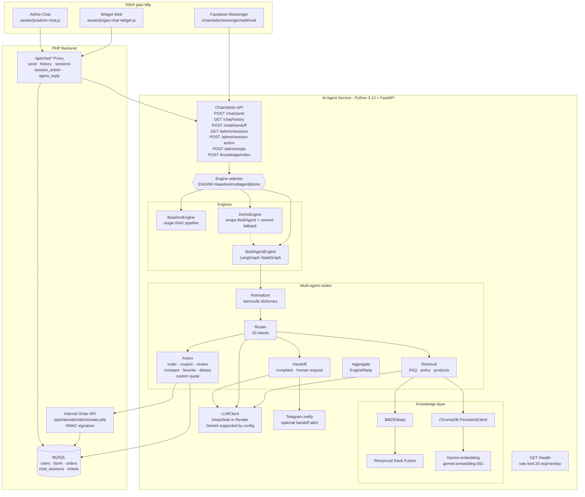
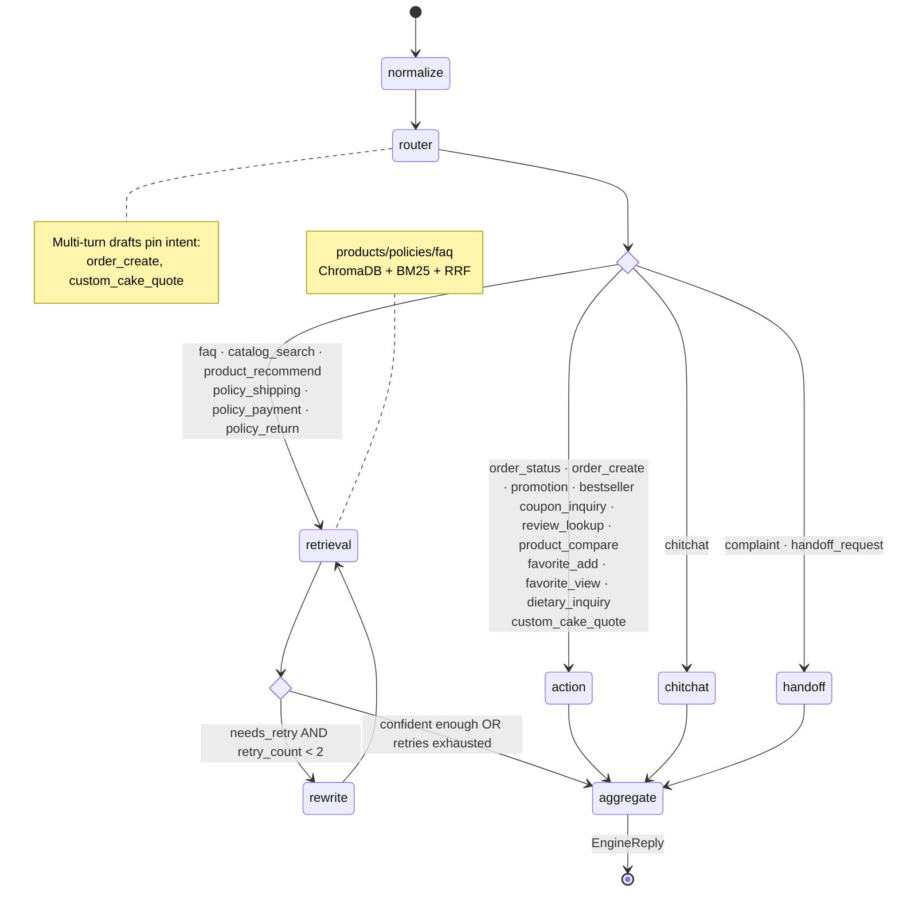
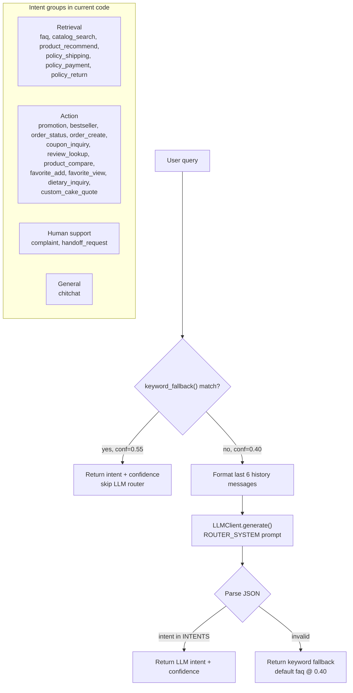
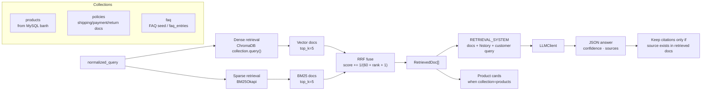
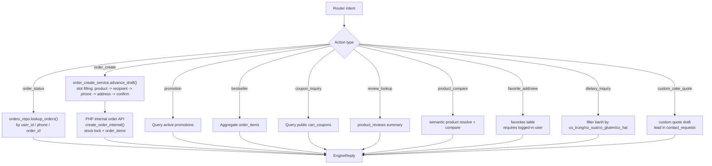
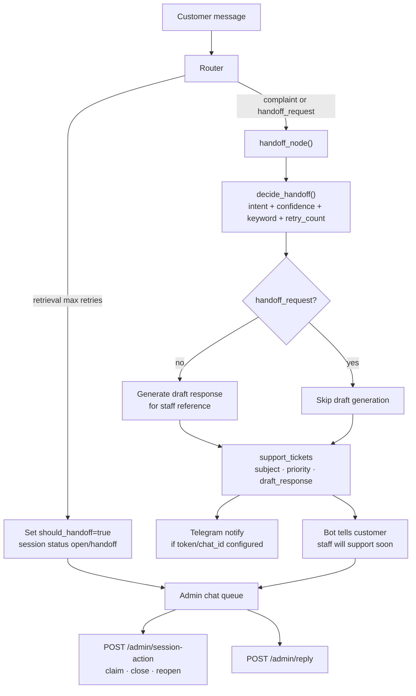
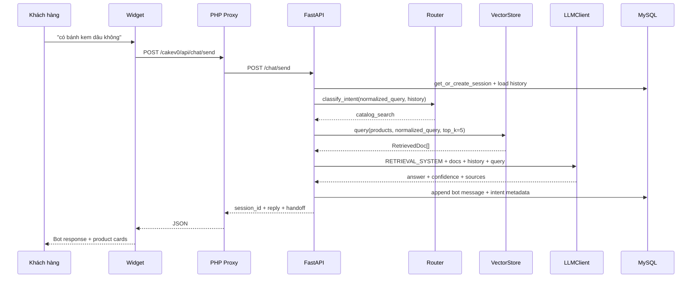
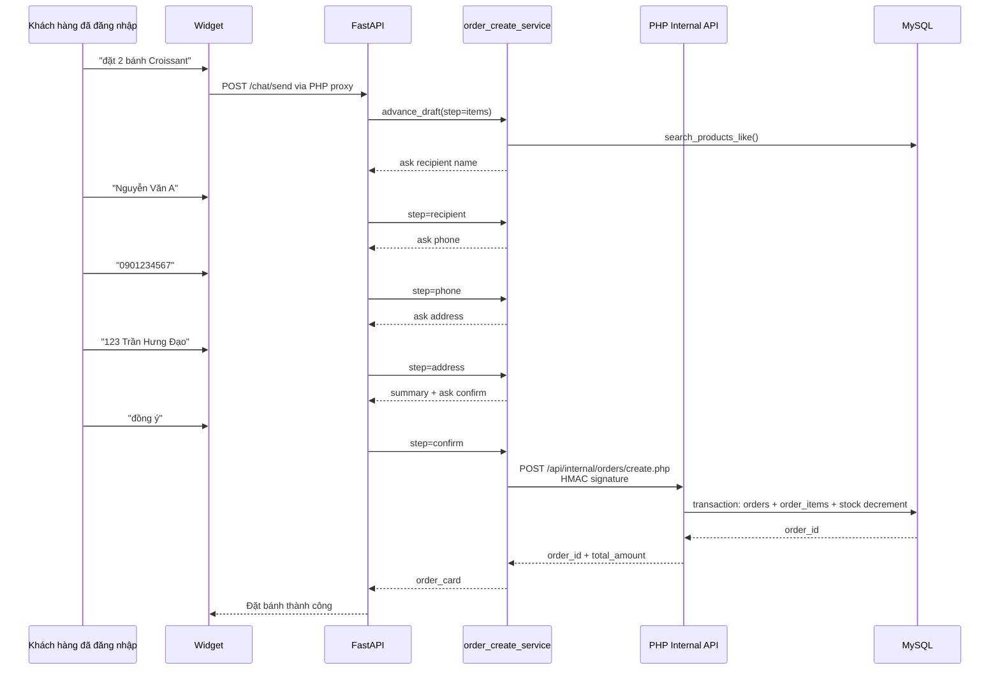
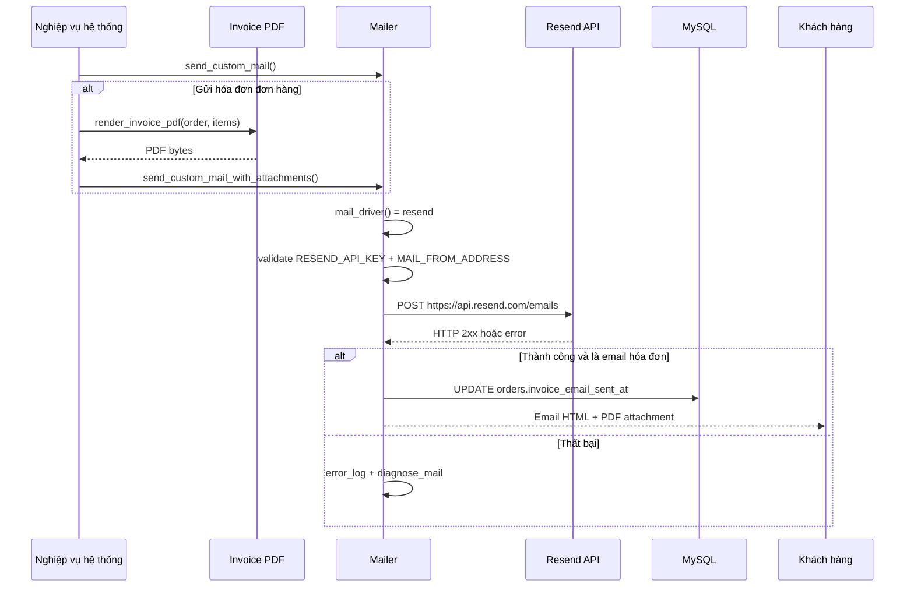

# Kiến trúc hệ thống - Sơ đồ kỹ thuật

> Tài liệu phục vụ chương Thiết kế hệ thống trong báo cáo khóa luận.
> Đã đồng bộ với codebase hiện tại: `ai-service/app/*`, `api/chat/*`, `includes/chat_proxy_helpers.php`, `database/migrations/*`.

---

## 1. Tổng quan kiến trúc hệ thống

---

## 2. LangGraph Multi-Agent State Machine

Sơ đồ phản ánh `ai-service/app/engines/multiagent/graph.py`.

---

## 3. Router Agent - 20 intent

Sơ đồ phản ánh `ai-service/app/engines/multiagent/router.py`.

---

## 4. Hybrid Retrieval Pipeline

Sơ đồ phản ánh `ai-service/app/knowledge/vector_store.py` và `ai-service/app/engines/multiagent/retrieval.py`.

---

## 5. Action Agent

Sơ đồ phản ánh `ai-service/app/engines/multiagent/action.py`, `features.py`, `order_create.py`, `custom_quote.py`.

---

## 6. Handoff Escalation Flow

Sơ đồ phản ánh `ai-service/app/engines/multiagent/handoff.py`, `ticket_repo.py`, `notify.py` và admin endpoints trong `api/chat.py`.

---

## 7. Baseline vs Multi-Agent

| Tiêu chí | BaselineEngine | MultiAgentEngine |
|---|---|---|
| Routing | Không phân loại intent | `keyword_fallback()` + LLM router |
| Retrieval | Search cả `faq`, `policies`, `products` | Search collection theo intent |
| Action | Không tạo/truy vấn đơn trực tiếp | Có action node cho đơn hàng, coupon, review, favorite, dietary, custom quote |
| Retry | Không có rewrite cycle | Retrieval có rewrite tối đa 2 lần |
| Handoff | Confidence thấp | Complaint/handoff intent + low confidence/retry signal |
| Citation | Có, nếu LLM trả source hợp lệ | Có, theo collection phù hợp |
| Demo fallback | Không | `DemoEngine` bắt lỗi và trả canned response theo keyword |

---

## 8. Data Flow - Một lượt chat tìm sản phẩm

---

## 9. Data Flow - Tạo đơn COD qua chat

---

## 10. Data Flow - Gửi email và hóa đơn qua Resend

Ghi chú:

- Mail driver hiện hỗ trợ `smtp`, `gmail_api`, `resend`.
- Resend yêu cầu `MAIL_DRIVER=resend`, `RESEND_API_KEY`, `MAIL_FROM_ADDRESS`.
- Các nghiệp vụ dùng mail chung gồm xác thực đăng ký, phản hồi liên hệ, thông báo yêu cầu mật khẩu và hóa đơn PDF.
