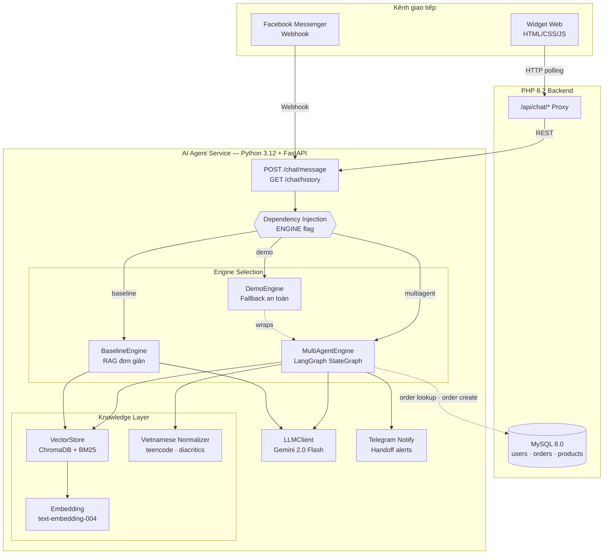
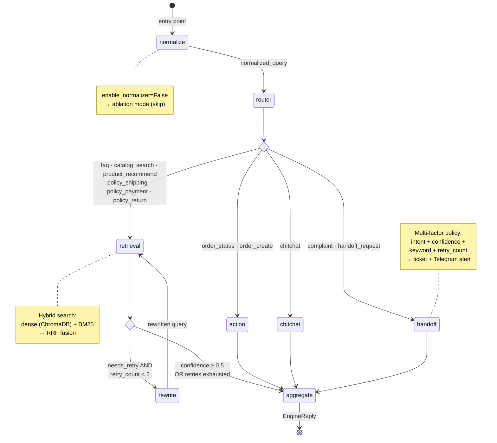
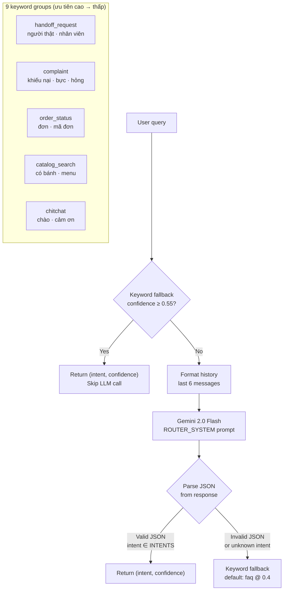
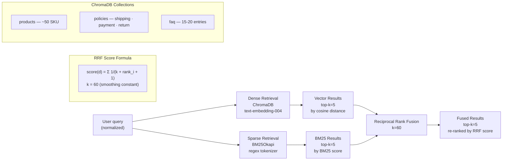
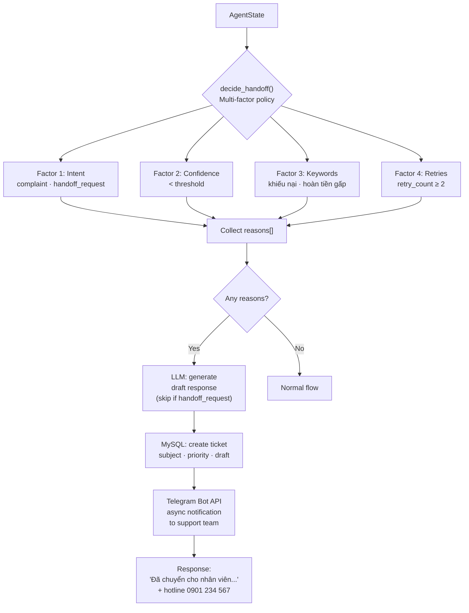
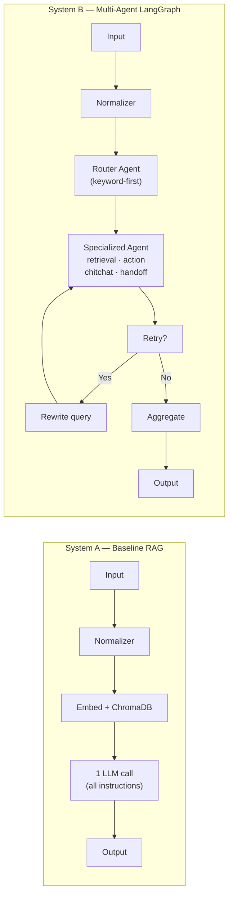
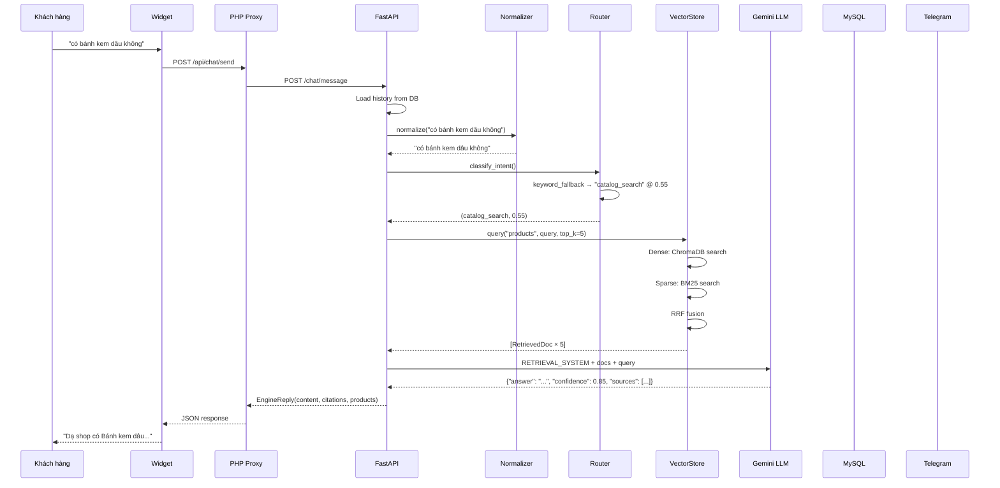

# Kiến trúc hệ thống — Sơ đồ kỹ thuật

> Tài liệu phục vụ chương Thiết kế hệ thống trong báo cáo khóa luận.
> Render Mermaid bằng GitHub, VS Code plugin, hoặc mermaid.live.

---

## 1. Tổng quan kiến trúc hệ thống

---

## 2. LangGraph Multi-Agent State Machine

Sơ đồ phản ánh `app/engines/multiagent/graph.py` — `build_graph()`.

---

## 3. Router Agent — Phân luồng intent

Sơ đồ phản ánh `app/engines/multiagent/router.py` — `classify_intent()`.

---

## 4. Hybrid Retrieval Pipeline (Phase 2)

Sơ đồ phản ánh `app/knowledge/vector_store.py` — `VectorStore.query()`.

---

## 5. Handoff Escalation Flow

Sơ đồ phản ánh `app/engines/multiagent/handoff.py` + `app/services/notify.py`.

---

## 6. So sánh kiến trúc: Baseline vs Multi-Agent

| Tiêu chí | System A | System B |
|----------|----------|----------|
| LLM calls/turn | 1 | 2-3 |
| Routing | Không | Keyword-first + LLM fallback |
| Retrieval | Single-stage, all sources | Per-collection + BM25 hybrid |
| Retry | Không | Query rewrite, max 2 |
| Handoff | confidence < 0.6 | Multi-factor (4 signals) |
| Action | Text only | Order lookup + COD creation |
| Citation | Dễ lẫn nguồn | Per-collection, chính xác |

---

## 7. Data Flow — Một request hoàn chỉnh

