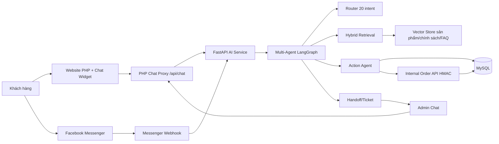
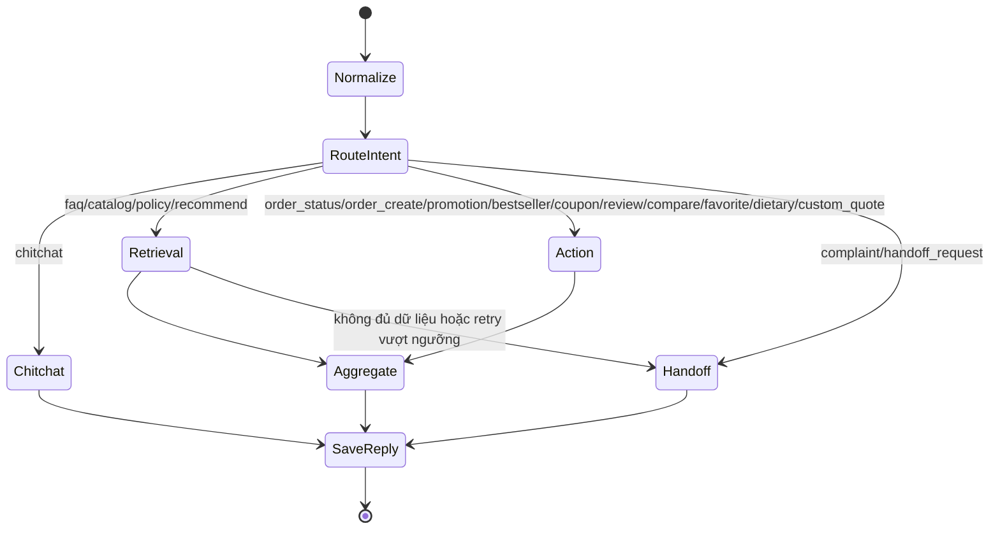
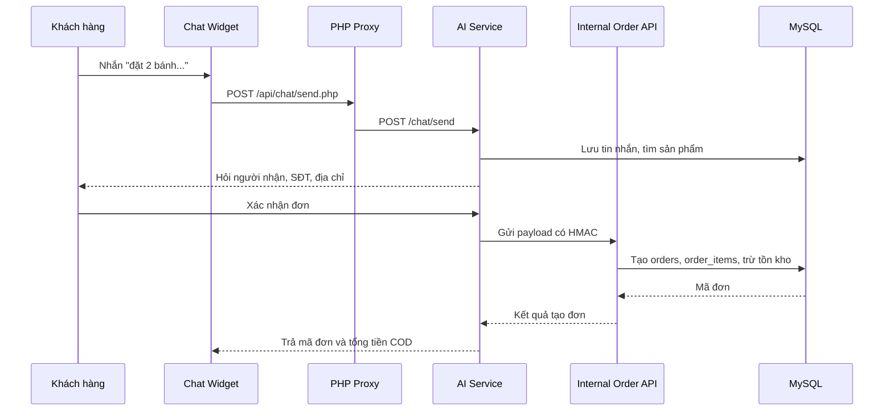
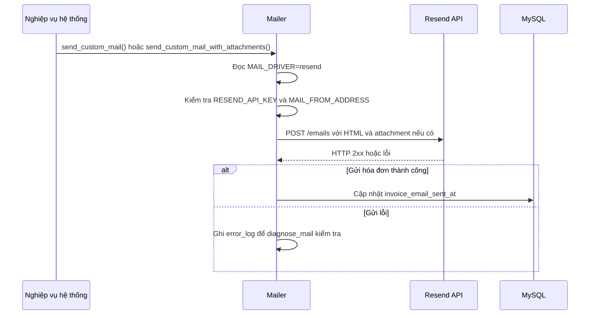

TRƯỜNG ĐẠI HỌC GIAO THÔNG VẬN TẢI TP. HỒ CHÍ MINH

**VIỆN CÔNG NGHỆ THÔNG TIN VÀ ĐIỆN, ĐIỆN TỬ**

**ĐỒ ÁN MÔN HỌC**

**PHÂN TÍCH VÀ THIẾT KẾ HỆ THỐNG**

**TÊN ĐỀ TÀI**

**HỆ THỐNG QUẢN LÝ ĐẶT BÁNH TRỰC TUYẾN**

**GVHD:** Lê Huỳnh Long

**SVTH:**

075305003342\_Bùi Thị Kiều My

066304000120\_Lương Ngọc Phượng

052205013759\_Hà Nguyễn Thiện Nhân

2251120333\_Võ Lý Nhật Anh

091205003864\_ Trương Quang Vũ

064205005002\_Nguyễn Trí Dũng

***Thành phố Hồ Chí Minh, ngày 23 tháng 4 năm 2025***

**MỤC LỤC**

[**PHÂN CÔNG NHIỆM VỤ iii**](#_Toc20675)

[**LỜI MỞ ĐẦU iv**](#_Toc29104)

[**LỜI CẢM ƠN v**](#_Toc20828)

[**CHƯƠNG 1: KHẢO SÁT HIỆN TRẠNG VÀ YÊU CẦU HỆ THỐNG 1**](#_Toc18415)

[**1.1. Khảo sát 1**](#_Toc19613)

[1.1.1. Giới thiệu sơ bộ hệ thống 1](#_Toc18896)

[1.1.2. Đánh giá hiện trạng 1](#_Toc9008)

[**1.2. Yêu cầu về chức năng hệ thống 3**](#_Toc3093)

[1.2.1. Yêu cầu về chức năng 3](#_Toc31371)

[1.2.2. Yêu cầu về phi chức năng 4](#_Toc23343)

[**1.3. Các biểu mẫu phỏng vấn 5**](#_Toc32478)

[1.3.1. Kế hoạch phỏng vấn tổng quan 5](#_Toc9709)

[1.3.2. Bảng phỏng vấn kế hoạch cụ thể 6](#_Toc4507)

[**1.4. Mô hình hoá yêu cầu 10**](#_Toc9839)

[**CHƯƠNG 2: PHÂN TÍCH HỆ THỐNG 14**](#_Toc12558)

[**2.1. Xác định tác nhân hệ thống (Actor) 14**](#_Toc975)

[**2.2. Xác định các ca sử dụng (Use Case) 15**](#_Toc2525)

[2.2.1. Use Case Quản lý sử dụng 15](#_Toc14897)

[2.2.2. Use Case Khách hàng sử dụng 15](#_Toc26988)

[2.2.3. Use Case AI CSKH](#223-use-case-ai-cskh)

[**2.3. Sơ đồ Use Case 16**](#_Toc17416)

[2.3.1. Sơ đồ Use Case tổng quát 17](#_Toc16502)

[2.3.2. Use Case Đăng nhập 18](#_Toc5850)

[2.3.3. Use Case Đặt hàng 18](#_Toc8026)

[2.3.4. Use Case Cập nhật thông tin cá nhân 18](#_Toc22214)

[2.3.5. Use case Đánh giá sản phẩm 19](#_Toc32663)

[2.3.6. Use Case Thanh toán 19](#_Toc12001)

[2.3.7. Use Case Quản lý sản phẩm 19](#_Toc30516)

[2.3.8. Use Case Quản lý khách hàng 20](#_Toc20180)

[2.3.9. Use Case Quản lý đơn hàng 20](#_Toc23710)

[2.3.10. Use Case Khuyến mãi 20](#_Toc16878)

[2.3.11. Use Case Báo cáo doanh thu 21](#_Toc16357)

[2.3.12. Use Case Quản lý đánh giá 21](#_Toc28283)

[**2.4. Mô tả Use Case 21**](#_Toc4791)

[2.4.1. Mô tả Use Case Đăng nhập 21](#_Toc22971)

[2.4.2. Mô tả Use Case Đặt hàng 22](#_Toc24182)

[2.4.3. Mô tả Use Case Cập nhật thông tin cá nhân 24](#_Toc9249)

[2.4.4. Mô tả Use Case Đánh giá sản phẩm 25](#_Toc29691)

[2.4.5. Mô tả Use Case Thanh toán 27](#_Toc3211)

[2.4.6. Mô tả Use Case Quản lý sản phẩm 28](#_Toc10863)

[2.4.7. Mô tả Use Case Quản lý khách hàng 29](#_Toc23099)

[2.4.8. Mô tả Use Case Quản lý đơn hàng 37](#_Toc11740)

[2.4.9. Mô tả Use Case Quản lý khuyến mãi 42](#_Toc19354)

[2.4.10. Mô tả Use Case Báo cáo doanh thu 44](#_Toc9067)

[2.4.11. Mô tả Use Case Quản lý đánh giá 46](#_Toc22538)

[2.4.12. Mô tả Use Case Chat với AI CSKH](#2412-mô-tả-use-case-chat-với-ai-cskh)

[2.4.13. Mô tả Use Case Tạo đơn COD qua chat](#2413-mô-tả-use-case-tạo-đơn-cod-qua-chat)

[2.4.14. Mô tả Use Case Handoff sang nhân viên](#2414-mô-tả-use-case-handoff-sang-nhân-viên)

[2.4.15. Mô tả Use Case Gửi email và hóa đơn qua Resend](#2415-mô-tả-use-case-gửi-email-và-hóa-đơn-qua-resend)

[**2.5. Sơ đồ hoạt động (Activity diagram) 50**](#_Toc22630)

[2.5.1. Sơ đồ hoạt động Use Case Đăng nhập 51](#_Toc17748)

[2.5.2. Sơ đồ hoạt động Use Case Đặt hàng 52](#_Toc6777)

[2.5.3. Sơ đồ hoạt động Use Case Cập nhật thông tin cá nhân 53](#_Toc21873)

[2.5.4. Sơ đồ hoạt động Use Case Đánh giá sản phẩm 54](#_Toc2757)

[2.5.5. Sơ đồ hoạt động Use Case Thanh toán 55](#_Toc14277)

[2.5.6. Sơ đồ hoạt động Use Case Quản lý sản phẩm 56](#_Toc2753)

[2.5.7. Sơ đồ hoạt động Use Case Quản lý khách hàng 58](#_Toc18257)

[2.5.8. Sơ đồ hoạt động Use Case Quản lý đơn hàng 59](#_Toc25963)

[2.5.9. Sơ đồ hoạt động Use Case Quản lý khuyến mãi 60](#_Toc11361)

[2.5.10. Sơ đồ hoạt động Use Case Báo cáo doanh thu 61](#_Toc24354)

[2.5.11. Sơ đồ hoạt động Use Case Quản lý đánh giá 62](#_Toc11685)

[**2.6. Sơ đồ lớp (Class diagram) 63**](#_Toc21692)

[**2.7. Sơ đồ tuần tự (Sequence diagram) 64**](#_Toc4803)

[2.7.1. Sơ đồ tuần tự Use Case Đăng nhập 64](#_Toc15672)

[2.7.2. Sơ đồ tuần tự Use Case Đặt hàng 65](#_Toc21741)

[2.7.3. Sơ đồ tuần tự Use Case Cập nhật thông tin cá nhân 66](#_Toc14978)

[2.7.4. Sơ đồ tuần tự Use Case Đánh giá sản phẩm 67](#_Toc28116)

[2.7.5. Sơ đồ tuần tự Use Case Thanh toán 68](#_Toc10522)

[2.7.6. Sơ đồ tuần tự Use Case Quản lý sản phẩm 69](#_Toc13127)

[2.7.7. Sơ đồ tuần tự Use Case Quản lý khách hàng 70](#_Toc28083)

[2.7.8. Sơ đồ tuần tự Use Case Quản lý đơn hàng 71](#_Toc19651)

[2.7.9. Sơ đồ tuần tự Use Case Quản lý khuyến mãi 72](#_Toc30987)

[2.7.10. Sơ đồ tuần tự Use Case Báo cáo doanh thu 73](#_Toc31352)

[2.7.11. Sơ đồ tuần tự Use Case Quản lý đánh giá 74](#_Toc31569)

[**2.8. Bổ sung sơ đồ cho các chức năng hiện tại**](#28-bổ-sung-sơ-đồ-cho-các-chức-năng-hiện-tại)

[**CHƯƠNG 3: THIẾT KẾ HỆ THỐNG 75**](#_Toc24983)

[**3.1. Sơ đồ menu chính 75**](#_Toc19399)

[**3.2. Giao diện màn hình các chức năng 76**](#_Toc28639)

[3.2.1. Giao diện Màn hình chính 76](#_Toc28304)

[3.2.2. Giao diện Đăng nhập 77](#_Toc14531)

[3.2.3. Giao diện Cập nhật thông tin cá nhân 78](#_Toc12740)

[3.2.4. Giao diện Đặt hàng 78](#_Toc167)

[3.2.5. Giao diện Thanh toán 80](#_Toc25659)

[3.2.6. Giao diện Đánh giá sản phẩm 81](#_Toc3834)

[3.2.7. Giao diện Báo cáo doanh thu 81](#_Toc31672)

[3.2.8. Giao diện Quản lý đơn hàng 82](#_Toc26176)

[3.2.9. Giao diện Quản lý sản phẩm 82](#_Toc27988)

[3.2.10. Giao diện Quản lý đánh giá 83](#_Toc14660)

[3.2.11. Giao diện Quản lý khách hàng 83](#_Toc21083)

[3.2.12. Giao diện Quản lý khuyến mãi 84](#_Toc28431)

[3.2.13. Giao diện AI CSKH và quản trị phiên chat](#3213-giao-diện-ai-cskh-và-quản-trị-phiên-chat)

[3.2.14. Giao diện email, hóa đơn và xác thực](#3214-giao-diện-email-hóa-đơn-và-xác-thực)

[**3.3. Thiết kế dữ liệu bổ sung theo phiên bản hiện tại**](#33-thiết-kế-dữ-liệu-bổ-sung-theo-phiên-bản-hiện-tại)

[**3.4. Thiết kế API và tích hợp**](#34-thiết-kế-api-và-tích-hợp)

[**CHƯƠNG 4: TỔNG KẾT 85**](#_Toc1275)

[**4.1. Kết quả đạt được 85**](#_Toc21330)

[**4.2. Ưu điểm và khuyết điểm của hệ thống 86**](#_Toc31598)

[4.2.1. Ưu điểm của hệ thống 86](#_Toc16228)

[4.2.2. Khuyết điểm của hệ thống 86](#_Toc7568)

[**4.3. Hướng phát triển hệ thống trong tương lai 87**](#_Toc10254)

PHÂN CÔNG NHIỆM VỤ

|  |  |  |
| --- | --- | --- |
| **MSSV** | **Họ và tên** | **Nhiệm vụ** |
| 075305003342 | Bùi Thị Kiều My | Sơ đồ chức năng Đăng nhập; Sơ đồ lớp; Thiết kế web |
| 066304000120 | Lương Ngọc Phượng | Sơ đồ chức năng Đánh giá sản phẩm, Quản lý đơn hàng, Quản lý đánh giá; Trình bày Word |
| 052205013759 | Hà Nguyễn Thiện Nhân | Sơ đồ chức năng Quản lý khách hàng, Quản lý sản phẩm; Chương 4 |
| 2251120333 | Võ Lý Nhật Anh | Sơ đồ chức năng Thanh toán; Thiết kế web; Chương 1 |
| 091205003864 | Trương Quang Vũ | Sơ đồ chức năng Đặt hàng, Khuyến mãi; |
| 064205005002 | Nguyễn Trí Dũng | Sơ đồ chức năng Báo cáo doanh thu, Cập nhật thông tin cá nhân |
|  | Đinh Ngọc Mạnh | Không tham gia hoàn thành báo cáo |

LỜI MỞ ĐẦU

Hiện nay, cùng với sự phát triển mạnh mẽ của công nghệ thông tin và thương mại điện tử, việc mua sắm trực tuyến đã trở thành xu hướng phổ biến trong đời sống hiện đại. Trong lĩnh vực kinh doanh thực phẩm, đặc biệt là bánh ngọt và bánh sinh nhật, nhu cầu đặt bánh online ngày càng tăng do sự tiện lợi, nhanh chóng và phù hợp với nhịp sống bận rộn của khách hàng. Khách hàng có thể dễ dàng lựa chọn sản phẩm, đặt hàng và thanh toán mà không cần đến trực tiếp cửa hàng. Điều này tạo ra cơ hội lớn cho các cửa hàng bánh mở rộng hoạt động kinh doanh, đồng thời cũng đặt ra yêu cầu cao hơn trong việc quản lý đơn hàng, thông tin khách hàng, sản phẩm và quá trình giao nhận.

Tuy nhiên, việc quản lý thủ công hoặc sử dụng các phương pháp truyền thống dễ dẫn đến sai sót trong quá trình tiếp nhận đơn hàng, kiểm soát số lượng sản phẩm, quản lý khách hàng và theo dõi doanh thu. Vì vậy, việc xây dựng một hệ thống quản lý đặt bánh trực tuyến là cần thiết nhằm hỗ trợ cửa hàng hoạt động hiệu quả, chính xác và chuyên nghiệp hơn.

Nhận thấy tầm quan trọng của vấn đề trên, nhóm chúng em đã tiến hành nghiên cứu và thực hiện đồ án với đề tài “Hệ Thống Quản Lý Đặt Bánh Trực Tuyến”. Hệ thống được xây dựng nhằm hỗ trợ các chức năng chính như quản lý sản phẩm bánh, quản lý khách hàng, tiếp nhận và xử lý đơn đặt hàng, quản lý thanh toán, cũng như hỗ trợ theo dõi và thống kê hoạt động kinh doanh. Thông qua việc ứng dụng công nghệ thông tin, hệ thống giúp giảm thiểu sai sót, tiết kiệm thời gian, nâng cao hiệu quả quản lý và cải thiện trải nghiệm người dùng.

Với những nội dung được trình bày trong báo cáo, nhóm chúng em hy vọng đề tài sẽ cung cấp cái nhìn tổng quan và thực tiễn về việc xây dựng Hệ Thống Quản Lý Đặt Bánh Trực Tuyến, từ đó có thể áp dụng trong thực tế tại các cửa hàng bánh hoặc mô hình kinh doanh nhỏ. Đồng thời, đây cũng là cơ sở để tiếp tục nghiên cứu, phát triển và hoàn thiện hệ thống trong tương lai, góp phần nâng cao chất lượng dịch vụ và đáp ứng tốt hơn nhu cầu của khách hàng trong thời đại số.

LỜI CẢM ƠN

Kính gửi thầy Lê Huỳnh Long,

Trước tiên, nhóm chúng em xin gửi lời cảm ơn chân thành và sâu sắc nhất đến Thầy Lê Huỳnh Long, giảng viên môn Phân Tích Thiết Kế Hệ Thống, người đã tận tình giảng dạy, hướng dẫn và truyền đạt những kiến thức quý báu giúp chúng em hoàn thành đồ án này.

Trong suốt quá trình học tập và thực hiện đồ án, thầy không chỉ cung cấp nền tảng lý thuyết vững chắc mà còn giúp chúng em tiếp cận các phương pháp phân tích, thiết kế hệ thống một cách khoa học và thực tiễn. Sự tận tâm của thầy trong giảng dạy, cùng những chia sẻ kinh nghiệm thực tiễn, đã giúp chúng em hiểu rõ hơn về cách ứng dụng kiến thức vào thực tế, đặc biệt trong việc xây dựng và hệ thống quản lý Homestay.

Chúng em cũng xin gửi lời cảm ơn đến các bạn trong nhóm, những người đã đóng góp ý kiến, chia sẻ tài liệu và cùng nhau trao đổi để giúp đồ án được hoàn thiện hơn.

Mặc dù đã nỗ lực hết sức, cùng với những cố gắng và đầu tư thời gian vào bài báo cáo nhưng với nhiều hạn chế về mặt kiến thức chuyên môn và kinh nghiệm thực tế, chúng em hiểu rằng những sai sót là điều không thể nào tránh khỏi. Chúng em rất mong rằng sẽ nhận được những góp ý, nhận xét và chỉnh sửa từ thầy để chúng em có thể nhìn nhận, hiểu rõ vấn đề để tiếp tục hoàn thiện và nâng cao kiến thức của mình.

Sau cùng, chúng em xin chân thành cảm ơn thầy vì những đóng góp to lớn trong hành trình học tập và giảng dạy cho nhóm em nói riêng và tập thể các bạn trong lớp nói chung. Chúng em chúc thầy có thật nhiều sức khỏe, hạnh phúc và luôn giữ vững ngọn lửa nghề nhiệt huyết để truyền đến không chỉ thế hệ chúng em mà còn thêm nhiều nhiều thế hệ sau nữa có được lượng kiến thức bổ ích và những bài học thực tế để chúng em có thể vững bước trên con đường học tập.

Xin chân thành cảm ơn!

CHƯƠNG 1: KHẢO SÁT HIỆN TRẠNG VÀ YÊU CẦU HỆ THỐNG

* 1. **Khảo sát**

1.1.1. Giới thiệu sơ bộ hệ thống

Hệ thống quản lý đặt bánh trực tuyến là một ứng dụng web được xây dựng dựa trên mô hình cửa hàng bánh truyền thống đã hoạt động trực tiếp. Nhằm hỗ trợ quá trình chuyển đổi số và tự động hóa hoạt động kinh doanh, hệ thống được phát triển để giúp cửa hàng quản lý việc bán hàng, đặt bánh và chăm sóc khách hàng một cách hiệu quả hơn thông qua môi trường trực tuyến.

Thông qua hệ thống, khách hàng có thể dễ dàng xem danh sách các loại bánh, xem thông tin chi tiết sản phẩm, thêm sản phẩm vào giỏ hàng và thực hiện đặt hàng mà không cần đến trực tiếp cửa hàng. Điều này giúp tiết kiệm thời gian cho khách hàng, đồng thời mở rộng khả năng tiếp cận sản phẩm của cửa hàng đến nhiều đối tượng hơn.

Hệ thống cung cấp các chức năng cơ bản cho khách hàng như đăng ký tài khoản, đăng nhập, xem sản phẩm, quản lý giỏ hàng và đặt hàng trực tuyến. Ngoài ra, khách hàng còn có thể theo dõi trạng thái đơn hàng, đánh giá sản phẩm và gửi phản hồi sau khi mua hàng. Một số chức năng mở rộng như viết blog cũng được tích hợp nhằm tạo không gian để người dùng chia sẻ trải nghiệm và cảm nhận về sản phẩm.

Đối với người quản lý, hệ thống hỗ trợ các chức năng như quản lý sản phẩm (thêm, sửa, xóa), quản lý đơn hàng, quản lý khách hàng. Bên cạnh đó, hệ thống còn hỗ trợ tạo chương trình khuyến mãi, theo dõi doanh thu và thống kê hoạt động kinh doanh nhằm giúp cửa hàng quản lý hiệu quả hơn so với phương pháp thủ công trước đây.

Hệ thống được thiết kế với các đối tượng chính bao gồm khách hàng, quản trị viên, sản phẩm, đơn hàng và giỏ hàng. Các chức năng được xây dựng tập trung vào việc tự động hóa quy trình đặt hàng, quản lý dữ liệu và hỗ trợ vận hành cửa hàng một cách thuận tiện, chính xác hơn. Việc xây dựng website không chỉ giúp giảm thiểu sai sót trong quản lý mà còn nâng cao trải nghiệm khách hàng và hỗ trợ cửa hàng phát triển hoạt động kinh doanh trong môi trường số.

1.1.2. Đánh giá hiện trạng

1. Ưu điểm:

**i. Tối ưu hóa quá trình đặt bánh:**

* Hệ thống quản lý danh sách sản phẩm bánh theo tên, loại và giá tiền, giúp người dùng dễ dàng lựa chọn sản phẩm phù hợp.
* Khách hàng có thể chủ động đặt bánh trực tuyến thông qua website mà không cần đến trực tiếp cửa hàng.
* Quy trình đặt hàng được thực hiện nhanh chóng thông qua các bước: chọn sản phẩm, thêm vào giỏ hàng và xác nhận đơn hàng.

**ii. Quản lý thông tin khách hàng:**

* Lưu trữ thông tin khách hàng như họ tên, số điện thoại, tài khoản đăng nhập và lịch sử đặt hàng.
* Hỗ trợ người quản lý theo dõi hành vi mua hàng và quản lý khách hàng hiệu quả hơn.

**iii. Nâng cao hiệu suất quản lý tài chính:**

* Hệ thống cho phép quản lý sản phẩm, đơn hàng và khách hàng một cách tập trung.
* Quản trị viên có thể dễ dàng thêm, sửa, xóa sản phẩm và theo dõi tình trạng đơn hàng.
* Hỗ trợ thống kê cơ bản về doanh thu và số lượng đơn hàng.

**iv. Cải thiện trải nghiệm khách hàng:**

* Giao diện đơn giản, dễ sử dụng giúp khách hàng dễ dàng thao tác khi đặt hàng.
* Hỗ trợ theo dõi trạng thái đơn hàng sau khi đặt.
* Cho phép khách hàng đánh giá, phản hồi hoặc chia sẻ trải nghiệm thông qua chức năng blog.

**v. Giảm tải công việc cho nhân sự:**

* Giảm thiểu việc ghi chép thủ công nhờ hệ thống quản lý dữ liệu tập trung.
* Hỗ trợ nhân viên theo dõi đơn hàng và xử lý thông tin nhanh chóng hơn.
* Hạn chế sai sót trong quá trình tiếp nhận và xử lý đơn hàng.

1. Nhược điểm:

**i. Chi phí triển khai và bảo trì:**

* Việc xây dựng và duy trì một website đặt bánh trực tuyến vẫn đòi hỏi chi phí nhất định cho việc phát triển, lưu trữ dữ liệu và bảo trì hệ thống.
* Đối với các cửa hàng quy mô nhỏ, chi phí này có thể là một trở ngại nếu không có nguồn lực kỹ thuật phù hợp.

**ii. Yêu cầu về kĩ năng sử dụng công nghệ:**

* Người quản lý và nhân viên cần có kiến thức cơ bản về sử dụng hệ thống web để quản lý sản phẩm và xử lý đơn hàng.
* Việc thao tác sai có thể dẫn đến nhầm lẫn trong cập nhật thông tin sản phẩm hoặc xử lý đơn hàng.

**iii. Vấn đề bảo mật và dữ liệu:**

* Thông tin khách hàng và dữ liệu đơn hàng cần được bảo vệ, tuy nhiên hệ thống có thể chưa được trang bị đầy đủ các cơ chế bảo mật nâng cao.
* Nguy cơ xảy ra lỗi dữ liệu hoặc mất dữ liệu nếu hệ thống không được sao lưu và kiểm tra thường xuyên.

**iv. Phụ thuộc nhiều vào Internet:**

* Hệ thống hoạt động dựa trên nền tảng web nên cần có kết nối Internet ổn định để khách hàng đặt hàng và quản lý xử lý đơn.
* Khi xảy ra sự cố mạng hoặc lỗi hệ thống, quá trình đặt hàng và quản lý có thể bị gián đoạn.

**v. Hạn chế về chức năng:**

* Hệ thống hiện tại đã hỗ trợ thanh toán COD, chuyển khoản và VNPAY, nhưng chưa mở rộng sang các ví điện tử phổ biến như Momo hoặc ZaloPay.
* Hệ thống đã có khuyến mãi, coupon, báo cáo doanh thu và AI CSKH, nhưng vẫn chưa có quản lý kho nguyên liệu, tối ưu giao hàng và dashboard đánh giá hiệu quả AI ở mức vận hành đầy đủ.

**1.2. Yêu cầu về chức năng hệ thống**

1.2.1. Yêu cầu về chức năng

* Chức năng đăng nhập
* Chức năng quản lý khách hàng
* Chức năng quản lý sản phẩm
* Chức năng quản lý đơn hàng
* Chức năng khuyến mãi
* Chức năng quản lý đánh giá
* Chức năng báo cáo doanh thu
* Chức năng cập nhật thông tin cá nhân
* Chức năng đặt hàng
* Chức năng thanh toán
* Chức năng đánh giá sản phẩm
* Chức năng đăng ký tài khoản có xác thực email
* Chức năng quên mật khẩu và yêu cầu đặt lại mật khẩu
* Chức năng lưu/xem/bỏ lưu sản phẩm yêu thích
* Chức năng áp dụng mã giảm giá khi thanh toán
* Chức năng thanh toán COD, chuyển khoản ngân hàng và VNPAY
* Chức năng gửi hóa đơn PDF qua email sau khi đơn được xác nhận hoặc thanh toán thành công
* Chức năng gửi email qua nhiều driver: SMTP, Gmail API hoặc Resend
* Chức năng liên hệ cửa hàng và quản trị viên phản hồi qua email
* Chức năng quản lý yêu cầu liên hệ, yêu cầu báo giá bánh đặt riêng và yêu cầu đặt lại mật khẩu
* Chức năng AI chăm sóc khách hàng trên website
* Chức năng khôi phục lịch sử hội thoại giữa khách hàng, AI và nhân viên
* Chức năng chuyển tiếp hội thoại từ AI sang nhân viên khi cần hỗ trợ thủ công
* Chức năng quản trị viên nhận, xử lý, đóng/mở lại phiên chat và trả lời khách hàng
* Chức năng tích hợp Messenger webhook cho kênh Facebook Messenger
* Chức năng xây dựng lại kho tri thức AI từ sản phẩm, chính sách và FAQ

**Bổ sung theo codebase hiện tại**

Để tài liệu phản ánh đúng phiên bản hệ thống hiện tại, các chức năng được chia theo nhóm như sau:

| Nhóm chức năng | Chức năng chi tiết | Đối tượng sử dụng |
| --- | --- | --- |
| Tài khoản và bảo mật | Đăng ký, đăng nhập, đăng xuất, xác thực email qua liên kết 24 giờ, gửi lại email xác thực bằng cách đăng ký lại cùng username/email đang chờ xác thực, kiểm tra độ mạnh mật khẩu, yêu cầu đặt lại mật khẩu, duyệt yêu cầu đặt lại mật khẩu bởi quản trị viên, CSRF cho các thao tác quan trọng. | Khách hàng, quản trị viên |
| Sản phẩm | Xem danh sách bánh, xem chi tiết sản phẩm, hiển thị ảnh chính và ảnh phụ, phân loại sản phẩm, tìm kiếm, mô tả sản phẩm, giá, tồn kho, nhãn dị ứng, sản phẩm khuyến mãi và sản phẩm bán chạy. | Khách hàng, quản trị viên |
| Giỏ hàng và đặt hàng | Thêm sản phẩm vào giỏ, cập nhật số lượng, xóa sản phẩm, nhập thông tin người nhận, địa chỉ, số điện thoại, ghi chú, tạo đơn hàng và lưu chi tiết đơn hàng. | Khách hàng |
| Thanh toán | Hỗ trợ COD, chuyển khoản ngân hàng QR Code và VNPAY sandbox; cập nhật trạng thái đơn sau kết quả VNPAY; xử lý mã giảm giá khi checkout. | Khách hàng, hệ thống |
| Hóa đơn và email | Sinh hóa đơn PDF, gửi hóa đơn qua email có file đính kèm, đánh dấu thời điểm đã gửi hóa đơn để tránh gửi trùng, gửi email qua SMTP/Gmail API/Resend, cung cấp công cụ chẩn đoán mail. | Hệ thống, quản trị viên |
| Đánh giá và phản hồi | Hiển thị điểm trung bình, phân bố sao, danh sách đánh giá sản phẩm, lọc đánh giá theo số sao, quản trị viên duyệt hoặc từ chối đánh giá. | Khách hàng, quản trị viên |
| Yêu thích | Lưu/bỏ lưu sản phẩm yêu thích, xem trang sản phẩm đã lưu, hiển thị số lượng yêu thích trên header, AI có thể thêm/xem danh sách yêu thích khi khách đã đăng nhập. | Khách hàng, AI CSKH |
| Khuyến mãi và coupon | Quản lý chương trình khuyến mãi theo sản phẩm, quản lý mã giảm giá với phần trăm giảm, giá trị đơn tối thiểu, giới hạn lượt dùng, trạng thái hoạt động, ngày bắt đầu/kết thúc; AI chỉ công khai mã coupon được phép hiển thị. | Quản trị viên, khách hàng, AI CSKH |
| Quản trị | Quản lý sản phẩm, ảnh sản phẩm, khách hàng, đơn hàng, trạng thái đơn, khuyến mãi, coupon, đánh giá, yêu cầu liên hệ, yêu cầu đặt lại mật khẩu, thống kê doanh thu và sản phẩm bán chạy. | Quản trị viên |
| AI chăm sóc khách hàng | Widget chat trên website, lưu phiên và lịch sử chat, phân loại 20 intent, tư vấn sản phẩm, tìm kiếm menu, gợi ý bánh, hỏi chính sách, tra cứu đơn, tạo đơn COD qua chat, xem khuyến mãi, hỏi mã giảm giá, xem đánh giá, so sánh sản phẩm, lọc theo dị ứng, lưu/xem yêu thích, báo giá bánh đặt riêng, xử lý khiếu nại và chuyển nhân viên. | Khách hàng, quản trị viên, hệ thống |
| Tích hợp ngoài | PHP proxy gọi FastAPI AI service, API nội bộ tạo đơn từ AI có chữ ký HMAC, Messenger webhook có xác minh chữ ký, thông báo handoff qua Telegram khi cấu hình. | Hệ thống |

1.2.2. Yêu cầu về phi chức năng

* **Giao diện người dùng (UI/UX):** Giao diện website thân thiện, bố cục rõ ràng, dễ sử dụng cho cả khách hàng và quản trị viên. Hình ảnh sản phẩm bánh hiển thị rõ nét, hấp dẫn. Thiết kế tương thích trên nhiều thiết bị như máy tính và điện thoại thông qua trình duyệt web.
* **Hiệu suất hoạt động:** Hệ thống có tốc độ xử lý nhanh, phản hồi kịp thời các thao tác như xem sản phẩm, thêm vào giỏ hàng và đặt hàng. Đảm bảo hoạt động ổn định khi có nhiều người truy cập cùng lúc.
* **Tính tương thích và tối ưu:** Hệ thống hoạt động tốt trên các trình duyệt phổ biến như Chrome, Edge, Cốc Cốc. Tối ưu tốc độ tải trang và dung lượng dữ liệu để nâng cao trải nghiệm người dùng
* **Tối ưu hóa tài nguyên:** Hệ thống nhẹ, chiếm ít tài nguyên phần cứng, hoạt động tốt trên nhiều nền tảng và trình duyệt khác nhau.
* **Bảo mật:** Đảm bảo an toàn thông tin tài khoản và dữ liệu khách hàng. Mật khẩu được mã hóa, hạn chế truy cập trái phép vào hệ thống. Đảm bảo an toàn trong các chức năng liên quan đến thanh toán.
* **Khả năng bảo trì và nâng cấp:** Hệ thống dễ dàng bảo trì, sửa lỗi và nâng cấp. Có khả năng mở rộng thêm các chức năng mới như tích hợp thanh toán trực tuyến, giao hàng hoặc chương trình khuyến mãi .
* **Hiệu quả chi phí:** Hệ thống được xây dựng với chi phí hợp lý, phù hợp với quy mô cửa hàng bánh. Tối ưu tài nguyên sử dụng để giảm chi phí vận hành lâu dài.

**1.3. Các biểu mẫu phỏng vấn**

1.3.1. Kế hoạch phỏng vấn tổng quan

|  |  |  |  |  |
| --- | --- | --- | --- | --- |
| **Hệ thống:** Quản lý đặt bánh trực tuyến  **Người lập:** Võ Lý Nhật Anh Ngày lập: 18/03/2026 | | | | |
| **Stt** | **Chủ đề** | **Yêu cầu** | **Ngày**  **bắt đầu** | **Ngày kết thúc** |
| 1 | Quy trình tiếp nhận đơn hàng | Làm rõ cách khách hàng chọn bánh, tùy chỉnh yêu cầu (chữ ghi trên bánh), và thủ tục thanh toán. | 18/03/2026 | 18/03/2026 |
| 2 | Quản lý sản xuất và bếp | Xác định quy trình tiếp nhận đơn từ hệ thống xuống bếp, theo dõi tiến độ làm bánh. | 18/03/2026 | 18/03/2026 |
| 3 | Quản lý thông tin sản phẩm | Cách cập nhật danh mục bánh: loại bánh, giá cả, và hình ảnh mẫu. | 18/03/2026 | 18/03/2026 |
| 4 | Quản lý nguyên liệu kho | Cách thống kê nguyên liệu (bột, bơ, trứng, sữa...) sắp hết và nhập kho bổ sung. | 18/03/2026 | 18/03/2026 |
| 5 | Quản lý giao hàng (Shipper) | Phân phối đơn cho nhân viên giao hàng, theo dõi trạng thái giao hàng, đảm bảo bánh không bị hỏng. | 19/03/2026 | 19/03/2026 |
| 6 | Quản lý khách hàng | Nhập và lưu trữ thông tin khách hàng (tên, SĐT, địa chỉ), quản lý lịch sử đặt bánh. | 19/03/2026 | 19/03/2026 |
| 7 | Báo cáo doanh thu | Quy trình xuất báo cáo doanh số, thống kê các mẫu bánh bán chạy nhất theo ngày, tháng. | 19/03/2026 | 19/03/2026 |
| 8 | Yêu cầu giao diện người dùng | Xác định mong muốn về giao diện: trực quan, hình ảnh bắt mắt, dễ dàng thao tác . | 20/03/2026 | 20/03/2026 |
| 9 | Yêu cầu hiệu suất và bảo mật | Mong muốn tốc độ xử lý nhanh (nhất là dịp Lễ, Tết), bảo mật thông tin thanh toán trực tuyến. | 20/03/2026 | 20/03/2026 |

1.3.2. Bảng phỏng vấn kế hoạch cụ thể

Bảng 1: Phỏng vấn Quản lý cửa hàng

|  |  |
| --- | --- |
| **Người được phỏng vấn:** Nguyễn Văn Nam (Quản lý cửa hàng) | **Ngày:** 18/03/2026 |
| **Câu Hỏi** | **Ghi nhận** |
| **Câu hỏi 1:** Việc quản lý đơn đặt bánh hiện nay có gây khó khăn gì cho anh không? | **Trả lời:** Hiện tại nhận đơn qua nhiều kênh (Zalo, Facebook, SĐT Hotline) nên thỉnh thoảng bị sót đơn hoặc quên ghi chú yêu cầu đặc biệt của khách.  **Kết quả quan sát:** Khá mệt mỏi với việc tổng hợp đơn thủ công. |
| **Câu hỏi 2:** Anh mong muốn hệ thống quản lý trực tuyến mới sẽ giúp giảm bớt khó khăn nào? | **Trả lời:** Muốn tất cả đơn hàng quy về một hệ thống chung, tự động phân loại đơn theo thời gian cần giao để bếp chủ động làm.  **Kết quả quan sát:** Rất quan tâm đến việc đồng bộ thông tin và tránh sai sót. |

Bảng 2: Phỏng vấn Bếp trưởng / Thợ làm bánh chính

|  |  |
| --- | --- |
| **Người được phỏng vấn:** Trần Thị Bích (Thợ làm bánh chính / Bếp trưởng) | **Ngày:** 18/03/2026 |
| **Câu Hỏi** | **Ghi nhận** |
| **Câu hỏi 1:** Việc nhận thông tin đơn hàng từ bộ phận quản lý hiện tại như thế nào? | **Trả lời:** Truyền đạt thông tin bằng giấy note hoặc qua nhóm chat dễ gây nhầm lẫn. Thường xuyên xảy ra sai sót ở khâu đọc ghi chú tùy chỉnh (ví dụ: nội dung chữ viết lên mặt bánh)..  **Kết quả quan sát:** Thông tin nội bộ giữa các phòng ban bị đứt gãy. Cách thức giao tiếp truyền thống không đáp ứng được tính chính xác. |
| **Câu hỏi 2:** Chị mong muốn cải thiện gì trong khâu vận hành của bếp? | **Trả lời:**Cần trang bị màn hình hiển thị đơn hàng trực tiếp tại bếp , sắp xếp theo thứ tự thời gian. Khi hoàn tất, thợ bánh có thể bấm xác nhận trên hệ thống để tự động thông báo cho thu ngân/giao hàng.  **Kết quả quan sát:** Mong muốn số hóa toàn bộ quy trình để tập trung tối đa vào chuyên môn sản xuất bánh. |

Bảng 3: Phỏng vấn nhân viên giao hàng

|  |  |
| --- | --- |
| **Người được phỏng vấn:** Lê Văn Công (Nhân viên giao hàng) | **Ngày:** 19/03/2026 |
| **Câu Hỏi** | **Ghi Nhận** |
| **Câu hỏi 1:** Quy trình giao bánh hiện tại đối với anh có trở ngại gì không? | **Trả lời:** Bánh kem là mặt hàng dễ hư hỏng nếu di chuyển xa. Hiện tại khâu phân bổ đơn chưa có tính năng tối ưu hóa lộ trình, dẫn đến việc giao hàng chậm trễ và phát sinh khiếu nại từ khách. |
| **Câu hỏi 2:** Anh mong muốn hệ thống hỗ trợ gì thêm cho anh trong khâu vận chuyển? | **Trả lời:** Cần một giao diện hoặc ứng dụng di động cho phép nhân viên thao tác cập nhật trạng thái theo thời gian thực như "Đã lấy hàng", "Đang giao", "Giao thành công" để cả cửa hàng và khách hàng cùng theo dõi.  **Kết quả quan sát:** Cần thiết kế một nền tảng Mobile App dành riêng cho đối tác giao hàng. |

Bảng 4: Phỏng vấn khách hàng

|  |  |
| --- | --- |
| **Người được phỏng vấn:** Phạm Thị Dung (Khách hàng thường xuyên) | **Ngày:** 19/03/2026 |
| **Câu Hỏi** | **Ghi Nhận** |
| **Câu hỏi 1:** Trải nghiệm đặt bánh hiện tại của chị qua các kênh đặt bánh trực tuyến của cửa hàng như thế nào? | **Trả lời:** Hành trình mua hàng khá mất thời gian. Khách phải nhắn tin hỏi đáp thủ công về mẫu mã, cốt bánh, bảng giá. Vào giờ cao điểm, nhân viên phản hồi rất chậm.  **Kết quả quan sát:** Trải nghiệm người dùng kém. Quy trình đặt hàng thiếu sự chủ động, làm giảm tỷ lệ chuyển đổi đơn hàng. |
| **Câu hỏi 2:** Chị kỳ vọng những tính năng gì ở một nền tảng đặt bánh trực tuyến chính thức? | **Trả lời:** Nền tảng cho phép khách hàng tự do xem danh mục, tùy chỉnh cấu hình bánh (mẫu mã, hương vị, kích thước), hiển thị báo giá minh bạch ngay lập tức và hỗ trợ thanh toán trực tuyến.  **Kết quả quan sát:** Khách hàng đề cao sự tiện lợi, minh bạch và hiện đại. Cần tích hợp luồng giỏ hàng và cổng thanh toán trực tuyến. |

Bảng 5: Phỏng vấn nhân viên kho nguyên liệu

|  |  |
| --- | --- |
| **Người được phỏng vấn:** Hoàng Lê Bách(Nhân viên kho nguyên liệu) | **Ngày:** 20/03/2026 |
| **Câu Hỏi** | **Ghi Nhận** |
| **Câu hỏi 1:** Công tác quản lý hạn sử dụng và tồn kho nguyên liệu (bột, kem, sữa...) đang có những rủi ro nào? | **Trả lời:** Nguyên liệu ngành bánh có vòng đời rất ngắn. Việc kiểm đếm và theo dõi hạn sử dụng hoàn toàn bằng tay thường xuyên dẫn đến sai sót, gây hư hỏng nguyên liệu và lãng phí chi phí vận hành.  **Kết quả quan sát:** Quản lý kho thủ công không đảm bảo được nguyên tắc FIFO (Nhập trước - Xuất trước), rủi ro hao hụt cao. |
| **Câu hỏi 2:** Anh có đề xuất tính năng chuyên sâu nào cho phân hệ quản lý kho của hệ thống mới không? | **Trả lời:** Hệ thống cần thiết lập định mức nguyên liệu. Khi có đơn hàng bán ra, hệ thống tự động khấu trừ tồn kho. Đồng thời, cần có tính năng cảnh báo tự động khi nguyên liệu sắp hết hạn hoặc chạm mức tồn kho tối thiểu.  **Kết quả quan sát:** Yêu cầu tích hợp thuật toán tính toán lượng tiêu hao tự động và hệ thống thông báo rủi ro hàng tồn kho. |

**1.4. Mô hình hoá yêu cầu**

|  |  |  |
| --- | --- | --- |
| Actor | Use Case | Mô tả |
| Quản lý | Xử lý đơn hàng | Quản lý có thể xem, chỉnh sửa, xác nhận hoặc hủy đơn đặt bánh của khách hàng. |
| Quản lý khách hàng | Quản lý có thể lưu trữ, cập nhật, tìm kiếm thông tin khách hàng và xử lý phản hồi của khách hàng. |
| Quản lý sản phẩm | Quản lý có thể thêm, sửa, xóa, cập nhật thông tin các loại bánh, giá, hình ảnh và mô tả. |
| Quản lý danh mục bánh | Quản lý có thể tạo, chỉnh sửa hoặc xóa các danh mục bánh như bánh sinh nhật, bánh kem, bánh ngọt,… |
| Khuyến mãi | Quản lý có thể tạo, chỉnh sửa, xóa các chương trình khuyến mãi, mã giảm giá để thu hút khách hàng. |
| Báo cáo doanh thu | Quản lý có thể xem thống kê, tổng hợp, phân tích doanh thu theo ngày, tháng, năm từ các đơn hàng. |
| Báo cáo đơn hàng | Quản lý có thể theo dõi số lượng đơn hàng, trạng thái đơn và tình hình bán hàng. |
| Đăng nhập | Cho phép quản lý đăng nhập vào hệ thống và kiểm tra quyền truy cập. |
| Nhân viên | Xử lý đơn hàng | Nhân viên có thể xem, xác nhận, cập nhật trạng thái đơn hàng (đã nhận, đang làm, đang giao, hoàn thành). |
| Quản lý khách hàng | Nhân viên có thể xem và cập nhật thông tin khách hàng khi cần. |
| Quản lý sản phẩm | Nhân viên có thể xem và cập nhật thông tin sản phẩm theo quyền được cấp. |
| Đăng nhập | Cho phép nhân viên đăng nhập vào hệ thống. |
| Khách hàng | Thanh toán | Cho phép khách hàng thanh toán khi đặt bánh bằng tiền mặt, chuyển khoản hoặc thanh toán online. |
| Đặt bánh | Cho phép khách hàng chọn bánh, nhập thông tin và gửi đơn đặt bánh trực tuyến. |
| Hủy đơn hàng | Cho phép khách hàng hủy đơn khi đơn chưa được xử lý. |
| Đánh giá phản hồi | Khách hàng có thể gửi đánh giá hoặc phản hồi về sản phẩm và dịch vụ. |
| Đăng ký / Đăng nhập | Cho phép khách hàng tạo tài khoản và đăng nhập để đặt bánh. |
| Hệ thống | Thanh toán | Hệ thống xử lý thanh toán, lưu thông tin giao dịch và cập nhật trạng thái đơn hàng. |
| Xử lý đơn hàng | Hệ thống tự động lưu đơn, cập nhật trạng thái và gửi thông báo cho người dùng. |
| Quản lý dữ liệu | Hệ thống lưu trữ dữ liệu khách hàng, sản phẩm, đơn hàng và báo cáo. |

**Bổ sung mô hình hóa yêu cầu theo phiên bản hiện tại**

| Actor | Use Case | Mô tả |
| --- | --- | --- |
| Khách hàng | Xác thực email đăng ký | Sau khi đăng ký, hệ thống lưu thông tin vào bảng chờ xác thực và gửi liên kết xác thực qua email. Tài khoản chỉ được tạo chính thức khi khách hàng mở liên kết hợp lệ trong thời hạn 24 giờ. |
| Khách hàng | Yêu cầu đặt lại mật khẩu | Khách hàng nhập email và mật khẩu mới; hệ thống tạo yêu cầu chờ duyệt để quản trị viên xác nhận trước khi cập nhật mật khẩu. |
| Khách hàng | Lưu sản phẩm yêu thích | Khách hàng đăng nhập có thể lưu, bỏ lưu và xem danh sách bánh yêu thích. |
| Khách hàng | Áp dụng mã giảm giá | Khách hàng nhập mã coupon ở bước checkout; hệ thống kiểm tra ngày hiệu lực, trạng thái hoạt động, đơn tối thiểu và giới hạn lượt dùng. |
| Khách hàng | Thanh toán VNPAY | Khách hàng chọn VNPAY, hệ thống chuyển sang cổng thanh toán, xác thực chữ ký khi nhận kết quả và cập nhật trạng thái đơn hàng. |
| Khách hàng | Nhận hóa đơn PDF qua email | Khi đơn được xác nhận hoặc thanh toán thành công, hệ thống sinh hóa đơn PDF và gửi cho khách hàng qua driver mail đang cấu hình. |
| Khách hàng | Chat với AI CSKH | Khách hàng sử dụng widget chat để hỏi sản phẩm, chính sách, khuyến mãi, mã giảm giá, đánh giá, so sánh bánh, dị ứng, đơn hàng hoặc yêu cầu nhân viên hỗ trợ. |
| Khách hàng | Đặt bánh qua chat | Khách hàng đã đăng nhập có thể đặt bánh COD qua hội thoại; AI thu thập sản phẩm, số lượng, người nhận, số điện thoại, địa chỉ và yêu cầu xác nhận trước khi gọi API nội bộ tạo đơn. |
| Khách hàng | Yêu cầu báo giá bánh đặt riêng | Khách hàng cung cấp mẫu bánh, kích thước, số người ăn, ngày nhận và số điện thoại; AI tạo lead trong yêu cầu liên hệ để nhân viên xử lý. |
| AI CSKH | Phân loại intent | AI router phân loại tin nhắn vào 20 intent gồm FAQ, tìm sản phẩm, gợi ý, khuyến mãi, bán chạy, tra cứu đơn, tạo đơn, chính sách, khiếu nại, handoff, coupon, review, so sánh, yêu thích, dị ứng và báo giá bánh riêng. |
| AI CSKH | Truy xuất tri thức | AI truy vấn kho tri thức từ sản phẩm, chính sách và FAQ bằng hybrid retrieval, sau đó tổng hợp câu trả lời có ngữ cảnh hội thoại. |
| AI CSKH | Thực hiện action | Với các intent cần dữ liệu nghiệp vụ, AI truy vấn MySQL hoặc gọi API nội bộ để trả lời bằng dữ liệu thật thay vì chỉ sinh văn bản. |
| AI CSKH | Chuyển nhân viên | Khi khách khiếu nại, yêu cầu gặp người thật hoặc hệ thống không đủ tự tin sau nhiều lần truy xuất, AI đánh dấu phiên cần hỗ trợ và có thể tạo ticket/thông báo. |
| Quản trị viên | Quản lý phiên chat | Quản trị viên xem danh sách phiên chat theo trạng thái, nhận phiên, trả lời khách, đóng hoặc mở lại phiên. |
| Quản trị viên | Quản lý coupon | Quản trị viên thêm, sửa, xóa mã giảm giá, thiết lập phần trăm giảm, đơn tối thiểu, giới hạn lượt dùng, trạng thái công khai và ngày hiệu lực. |
| Quản trị viên | Phản hồi liên hệ | Quản trị viên trả lời yêu cầu liên hệ hoặc lead bánh đặt riêng, hệ thống gửi email phản hồi cho khách. |
| Hệ thống | Gửi mail đa driver | Hệ thống chọn driver theo cấu hình `MAIL_DRIVER`: SMTP, Gmail API hoặc Resend; Resend dùng `RESEND_API_KEY` và `MAIL_FROM_ADDRESS`. |
| Hệ thống | Đồng bộ kênh Messenger | Hệ thống nhận webhook Messenger, xác minh chữ ký và đưa tin nhắn vào cùng engine AI CSKH. |
| Hệ thống | Reindex kho tri thức | Quản trị viên hoặc hệ thống gọi endpoint index để cập nhật lại vector store từ dữ liệu sản phẩm, chính sách và FAQ. |

CHƯƠNG 2: PHÂN TÍCH HỆ THỐNG

**2.1. Xác định tác nhân hệ thống (Actor)**

* **Quản lý:** Là người quản lý toàn bộ hệ thống đặt bánh trực tuyến, có quyền quản lý sản phẩm, danh mục bánh, khách hàng, đơn hàng, khuyến mãi và theo dõi doanh thu. Quản lý có thể chỉnh sửa dữ liệu, xác nhận đơn hàng và xem báo cáo hoạt động của cửa hàng.
* **Khách hàng:** Là người sử dụng hệ thống để xem sản phẩm, đặt bánh, hủy đơn, thanh toán và gửi đánh giá phản hồi. Khách hàng có thể đăng ký tài khoản, đăng nhập và theo dõi lịch sử đơn hàng của mình trên hệ thống.
* **AI CSKH:** Là tác nhân phần mềm tiếp nhận tin nhắn từ widget chat hoặc Messenger, phân loại ý định, truy xuất tri thức, trả lời câu hỏi và thực hiện một số nghiệp vụ như tra cứu đơn, tạo đơn COD, tư vấn coupon, so sánh sản phẩm, lọc theo dị ứng, quản lý yêu thích và tạo lead báo giá bánh đặt riêng.
* **Nhân viên hỗ trợ:** Là người tiếp nhận các phiên chat cần handoff, phản hồi trực tiếp cho khách hàng, xử lý khiếu nại và tiếp tục chăm sóc các lead được AI chuyển sang.
* **Dịch vụ ngoài:** Bao gồm VNPAY cho thanh toán trực tuyến, Resend/Gmail API/SMTP cho gửi email, Facebook Messenger cho kênh chat ngoài website và Telegram cho thông báo handoff khi được cấu hình.

**2.2. Xác định các ca sử dụng (Use Case)**

2.2.1. Use Case Quản lý sử dụng

* Đăng nhập
* Quản lý khách hàng
* Quản lý sản phẩm
* Quản lý đơn hàng
* Khuyến mãi
* Quản lý mã giảm giá/coupon
* Quản lý đánh giá
* Quản lý yêu cầu liên hệ và lead báo giá bánh đặt riêng
* Quản lý yêu cầu đặt lại mật khẩu
* Quản lý phiên chat AI CSKH: xem, nhận phiên, trả lời, đóng/mở lại phiên
* Quản lý hóa đơn gửi qua email
* Báo cáo doanh thu

2.2.2. Use Case Khách hàng sử dụng

* Chức năng đặt hàng
* Chức năng thanh toán
* Chức năng đánh giá sản phẩm
* Chức năng cập nhật thông tin cá nhân
* Chức năng đăng ký có xác thực email
* Chức năng yêu cầu đặt lại mật khẩu
* Chức năng lưu và xem sản phẩm yêu thích
* Chức năng áp dụng mã giảm giá
* Chức năng chat với AI CSKH
* Chức năng đặt bánh COD qua chat
* Chức năng tra cứu trạng thái đơn qua chat
* Chức năng yêu cầu báo giá bánh thiết kế riêng

2.2.3. Use Case AI CSKH

* Phân loại 20 nhóm ý định hội thoại
* Chuẩn hóa câu hỏi và ngữ cảnh hội thoại
* Truy xuất sản phẩm, chính sách và FAQ từ kho tri thức
* Tư vấn sản phẩm theo nhu cầu
* Tìm sản phẩm trong menu và trả về card sản phẩm
* Trả lời chính sách giao hàng, thanh toán, đổi trả
* Tra cứu trạng thái đơn hàng theo tài khoản, mã đơn hoặc số điện thoại
* Tạo đơn COD qua chat cho khách đã đăng nhập
* Gợi ý sản phẩm đang khuyến mãi và sản phẩm bán chạy
* Tư vấn mã giảm giá công khai
* Xem tóm tắt đánh giá sản phẩm
* So sánh hai sản phẩm
* Thêm và xem danh sách sản phẩm yêu thích
* Lọc sản phẩm theo tiêu chí dị ứng: trứng, sữa, gluten, hạt
* Thu thập yêu cầu báo giá bánh thiết kế riêng
* Tạo ticket và chuyển nhân viên khi gặp khiếu nại hoặc yêu cầu người thật

**2.3. Sơ đồ Use Case**

2.3.1. Sơ đồ Use Case tổng quát

2.3.2. Use Case Đăng nhập

2.3.3. Use Case Đặt hàng

2.3.4. Use Case Cập nhật thông tin cá nhân

2.3.5. Use case Đánh giá sản phẩm

2.3.6. Use Case Thanh toán

2.3.7. Use Case Quản lý sản phẩm

2.3.8. Use Case Quản lý khách hàng

2.3.9. Use Case Quản lý đơn hàng

2.3.10. Use Case Khuyến mãi

2.3.11. Use Case Báo cáo doanh thu

2.3.12. Use Case Quản lý đánh giá

**2.4. Mô tả Use Case**

2.4.1. Mô tả Use Case Đăng nhập

|  |  |
| --- | --- |
| **Use Case Description** | |
| **Use Case ID:** | UC-01 |
| **Tên Use Case:** | Đăng nhập |
| **Tác nhân chính:** | Khách hàng |
| **Tổng quan:** | Cho phép người dùng đăng nhập vào hệ thống. |
| **Độ ưu tiên:** | Cao |
| **Mối quan hệ:** | <<include>>: nhập thông tin đăng nhập <<extend>>: đăng xuất, quên mật khẩu |
| **Tiền điều kiện:** | Người dùng chưa đăng nhập và đã có tài khoản. |
| **Hậu điều kiện:** | * Nếu đăng nhập thành công: người dùng được chuyển đến trang chủ cần dùng website * Nếu đăng nhập thất bại: yêu cầu nhập lại. |
| **Dòng sự kiện chính:** | 1. Người dùng truy cập vào trang chủ. 2. Chọn đăng nhập. 3. Hệ thống hiển thị giao diện đăng nhập. 4. Người dùng nhập thông tin đăng nhập. 5. Hệ thống kiểm tra thông tin đăng nhập. 6. Nếu đăng nhập thành công, chuyển đến trang giao diện tương ứng với quyền người dùng. |
| **Dòng sự kiện phụ:** | **A. Hệ thống phát hiện thông tin đăng nhập không hợp lệ (tên đăng nhập hoặc mật khẩu sai).**  a. Hệ thống hiển thị thông báo lỗi “Thông tin đăng nhập không chính xác. Vui lòng thử lại.”  b. Hệ thống yêu cầu người dùng nhập lại thông tin đăng nhập.  c. Người dùng nhập lại tên đăng nhập và mật khẩu.  d. Hệ thống kiểm tra lại thông tin đăng nhập.  **B. Người dùng nhấn vào liên kết “Quên mật khẩu” từ giao diện đăng nhập.**  a. Hệ thống hiển thị form khôi phục mật khẩu.  b. Người dùng nhập thông tin đã đăng ký.  c. Hệ thống kiểm tra và gửi mã xác thực.  d. Người dùng nhập mã xác thực và đổi mật khẩu.  e. Hệ thống thông báo “Đổi mật khẩu thành công” và chuyển hướng về trang đăng nhập. |

2.4.2. Mô tả Use Case Đặt hàng

|  |  |
| --- | --- |
| **Use Case Description** | |
| **Use Case ID:** | UC-02 |
| **Tên Use Case:** | Đặt hàng |
| **Tác nhân chính:** | Khách hàng |
| **Tổng quan:** | Mô tả quá trình khách hàng thực hiện đặt hàng trên hệ thống bán bánh trực tuyến, bao gồm việc xem sản phẩm, quản lý giỏ hàng, nhập thông tin nhận hàng và thanh toán |
| **Độ ưu tiên:** | Cao |
| **Mối quan hệ:** | <<include>>: Nhập thông tin người nhận, Thanh toán  <<extend>>: Xem sản phẩm, Xem giỏ hàng, Cập nhật số lượng, Áp dụng khuyến mãi, Hủy hàng. |
| **Tiền điều kiện:** | * Hệ thống hoạt động bình thường * Khách hàng có thể truy cập vào hệ thống * Có sản phẩm trong hệ thống |
| **Hậu điều kiện:** | Đơn hàng được tạo thành công trong hệ thống  Thông tin đơn hàng được lưu vào cơ sở dữ liệu  Trạng thái đơn hàng là “Đã đặt” hoặc “Đang xử lý” |
| **Dòng sự kiện chính:** | 1. Khách hàng truy cập hệ thống  2. Khách hàng chọn xem sản phẩm  3. Khách hàng chọn sản phẩm và thêm vào giỏ hàng  4. Khách hàng mở giỏ hàng để kiểm tra  5. Khách hàng có thể cập nhật số lượng sản phẩm  6. Khách hàng tiến hành đặt hàng  7. Hệ thống yêu cầu nhập thông tin người nhận  8. Khách hàng nhập đầy đủ thông tin (tên, địa chỉ, SĐT)  9. Khách hàng chọn thanh toán  10. Hệ thống xử lý thanh toán  11. Hệ thống xác nhận đơn hàng thành công |
| **Dòng sự kiện phụ:** | **A. Khách hàng có thể hủy đơn hàng trong trường hợp là đơn hàng COD và chưa được xác nhận:**   1. Hệ thống hiển thị danh sách đơn hàng khách hàng đã đặt với phương thức thanh toán COD 2. Khách hàng chọn đơn hàng và chọn “Hủy đơn” 3. Hệ thống xem trạng thái đơn hàng:  * Nếu đơn hàng COD chưa được xác nhận thì hệ thống xác nhận hủy đơn. Khách hàng nhận thông báo “Hủy đơn thành công” * Nếu đơn hàng đã được xác nhận, hệ thống sẽ không hiển thị nút hủy đơn .   **B. Nếu khách hàng thanh toán thất bại :**  a. Hệ thống hiển thị thông báo lỗi, cho phép khách hàng thử lại hoặc hủy  **C. Nếu khách hàng muốn áp dụng khuyến mãi :**  a. Khách hàng nhập mã khuyến mãi  b. Hệ thống kiểm tra hợp lệ  c. Nếu hợp lệ → áp dụng giảm giá  **D. Nếu thêm sản phẩm vào giỏ hàng không thành công**  a. Hiển thị thông báo lỗi  b. Khách hàng quay lại xem và chọn lại sản phẩm |

2.4.3. Mô tả Use Case Cập nhật thông tin cá nhân

|  |  |
| --- | --- |
| **Use Case Description** | |
| **Use Case ID:** | UC-03 |
| **Tên Use Case:** | Cập nhật thông tin cá nhân |
| **Tác nhân chính:** | Khách hàng |
| **Tổng quan:** | Use case này mô tả quá trình khách hàng đăng nhập vào hệ thống và thực hiện việc cập nhật thông tin cá nhân, bao gồm chỉnh sửa dữ liệu, thay đổi mật khẩu và xem đơn hàng liên quan. |
| **Độ ưu tiên:** | Trung bình |
| **Mối quan hệ:** | <<extend>> Chỉnh sửa thông tin  <<extend>> Cập nhật mật khẩu  <<extend>> Xem đơn hàng |
| **Tiền điều kiện:** | Khách hàng đã đăng nhập vào hệ thống.  Thông tin cá nhân đã tồn tại trong cơ sở dữ liệu. |
| **Hậu điều kiện:** | Thông tin cá nhân của khách hàng được cập nhật thành công.  Hệ thống lưu lại lịch sử chỉnh sửa để phục vụ kiểm tra. |
| **Dòng sự kiện chính:** | 1. Khách hàng chọn chức năng “Cập nhật thông tin cá nhân” 2. Hệ thống hiển thị các tùy chọn chỉnh sửa thông tin, cập nhật mật khẩu, hoặc xem đơn hàng. 3. Khách hàng chọn hành động mong muốn và bấm lưu 4. Hệ thống thực hiện hành động và hiển thị kết quả. |
| **Dòng sự kiện phụ:** | **A. Nếu khách hàng nhập thông tin cập nhật không hợp lệ, hệ thống hiển thị thông báo lỗi, yêu cầu người dùng nhập lại**  **B. Nếu sai mật khẩu hiện tại khi đổi mật khẩu**  a. Hệ thống hiển thị: “Mật khẩu hiện tại không đúng”  b. Người dùng quay trở lại vè nhập lại mật khẩu  **C. Nếu khách hàng chưa có đơn hàng, hệ thống hiển thị thông báo “không có đơn hàng nào”.** |

2.4.4. Mô tả Use Case Đánh giá sản phẩm

|  |  |
| --- | --- |
| **Use Case Description** | |
| **Use Case ID:** | UC-04 |
| **Tên Use Case:** | Đánh giá sản phẩm |
| **Tác nhân chính:** | Khách hàng |
| **Tổng quan:** | Use case này mô tả quá trình khách hàng thực hiện đánh giá sản phẩm sau khi mua hàng, bao gồm viết nội dung đánh giá, chấm điểm sản phẩm, chỉnh sửa hoặc xóa đánh giá đã tạo. |
| **Độ ưu tiên:** | Trung bình |
| **Mối quan hệ:** | <<include>> Viết đánh giá  << include >> Xếp hạng sao |
| **Tiền điều kiện:** | Khách hàng đã đăng nhập vào hệ thống  Khách hàng đã mua sản phẩm |
| **Hậu điều kiện:** | Đánh giá được lưu vào hệ thống  Điểm đánh giá (số sao) được cập nhật  Hệ thống hiển thị đánh giá cho người dùng khác |
| **Dòng sự kiện chính:** | 1. Khách hàng truy cập vào trang chi tiết sản phẩm 2. Khách hàng chọn chức năng “Đánh giá sản phẩm” 3. Hệ thống hiển thị giao diện nhập đánh giá 4. Khách hàng thực hiện viết nội dung đánh giá 5. Khách hàng thực hiện chọn số sao (xếp hạng) 6. Khách hàng nhấn “Gửi đánh giá” 7. Hệ thống kiểm tra dữ liệu 8. Hệ thống lưu đánh giá vào cơ sở dữ liệu 9. Hệ thống hiển thị thông báo “Đánh giá thành công” |
| **Dòng sự kiện phụ:** | **A. Nội dung đánh giá không hợp lệ**  a. Nếu nội dung trống hoặc vi phạm quy định  b. Hệ thống yêu cầu nhập lại  **B. Lỗi hệ thống**  a. Nếu lỗi khi lưu dữ liệu  b. Hệ thống hiển thị: “Không thể thực hiện, vui lòng thử lại” |

2.4.5. Mô tả Use Case Thanh toán

|  |  |
| --- | --- |
| **Use Case Description** | |
| **Use Case ID:** | UC-05 |
| **Tên Use Case:** | Thanh toán |
| **Tác nhân chính:** | Khách hàng |
| **Tổng quan:** | Cho phép khách hàng thanh toán đơn hàng bằng COD, chuyển khoản ngân hàng (QR), hoặc VNPAY. |
| **Độ ưu tiên:** | Cao |
| **Mối quan hệ:** | <<include>> Chọn phương thức thanh toán  <<extend>>Xem hoá đơn |
| **Tiền điều kiện:** | Đơn hàng đã được đặt |
| **Hậu điều kiện:** | Nếu thanh toán thành công: đơn hàng sẽ cập nhật trạng thái  Nếu thanh toán thất bại: đơn hàng sẽ được chờ thanh toán |
| **Dòng sự kiện chính:** | 1. Khách hàng chọn thanh toán. 2. Hệ thống yêu cầu khách hàng chọn phương thức thanh toán. 3. Khách hàng chọn phương thức thanh toán:  * Chọn phương thức tiền mặt * Chọn phương thức chuyển khoản  1. Khách hàng thanh toán xác nhận giao dịch. 2. Hệ thống xử lý giao dịch. 3. Hệ thống cập nhật trạng thái giao dịch.   7. Hệ thống in hóa đơn cho khách hàng. |
| **Dòng sự kiện phụ:** | **A. Nếu giao dịch thanh toán không thành công, hệ thống xử lý như sau:**  a. Hệ thống hiển thị thông báo: "Giao dịch không thành công."  b. Nếu khách hàng chọn thử lại, hệ thống thực hiện lại bước 3 của luồng chính.  c. Nếu khách hàng chọn huỷ thanh toán, hệ thống kết thúc phiên thanh toán  **B. Lỗi kết nối/gián đoạn khi chuyển hướng cổng thanh toán:** a. Hiển thị thông báo lỗi. b. Cho phép thử lại hoặc quay về trang chủ. |

2.4.6. Mô tả Use Case Quản lý sản phẩm

|  |  |
| --- | --- |
| **Use Case Description** | |
| **Use Case ID:** | UC-06 |
| **Tên Use Case:** | Quản lý sản phẩm |
| **Tác nhân chính:** | Quản lý |
| **Tổng quan:** | Use case này mô tả quá trình Quản lý quản lý sản phẩm trong hệ thống, bao gồm thêm sản phẩm mới, xóa sản phẩm và cập nhật thông tin sản phẩm nhằm đảm bảo dữ liệu sản phẩm luôn chính xác và đầy đủ. |
| **Độ ưu tiên:** | Cao |
| **Mối quan hệ:** | << extend >> Thêm sản phẩm  <<extend>> Xóa sản phẩm  <<extend>> Cập nhật thông tin sản phẩm |
| **Tiền điều kiện:** | - Quản lý đã đăng nhập vào hệ thống  -Hệ thống đang hoạt động bình thường |
| **Hậu điều kiện:** | * Sản phẩm được thêm/xóa/cập nhật thành công * Dữ liệu sản phẩm được lưu vào hệ thống |
| **Dòng sự kiện chính:** | 1. Quản lý chọn chức năng “Quản lý sản phẩm”  2. Hệ thống hiển thị danh sách sản phẩm  3. Quản lý chọn thao tác (thêm / xóa / cập nhật)  4. Hệ thống hiển thị form tương ứng  5. Quản lý nhập hoặc chỉnh sửa thông tin sản phẩm  6. Quản lý xác nhận thao tác  7. Hệ thống lưu dữ liệu và hiển thị kết quả |
| **Dòng sự kiện phụ:** | **A. Nếu thông tin nhập không hợp lệ → hệ thống yêu cầu nhập lại**  a. Người dùng thực hiện lại thao tác  b. Kết thúc hoạt động **B. Nếu thêm sản phẩm bị trùng → hệ thống thông báo** |

2.4.7. Mô tả Use Case Quản lý khách hàng

|  |  |
| --- | --- |
| **Use Case Description** | |
| **Use Case ID:** | UC-07 |
| **Tên Use Case:** | Quản lý khách hàng |
| **Tác nhân chính:** | Quản lý |
| **Tổng quan:** | Cho phép Quản lý quản lý thông tin khách hàng trong hệ thống bao gồm tìm kiếm, xem chi tiết, cập nhật thông tin và khóa/mở tài khoản khách hàng. |
| **Độ ưu tiên:** | Cao |
| **Mối quan hệ:** | <<include>> Xem chi tiết khách hàng  <<extend>> Tìm kiếm khách hàng  <<extend>> Khóa/Mở tài khoản |
| **Tiền điều kiện:** | - Quản lý đã đăng nhập vào hệ thống  - Hệ thống đã có dữ liệu khách hàng |
| **Hậu điều kiện:** | * Nếu thao tác thành công: Thông tin khách hàng được cập nhật chính xác , Trạng thái tài khoản được thay đổi * Nếu thao tác thất bại: Dữ liệu không thay đổi, Hệ thống hiển thị thông báo lỗi |
| **Dòng sự kiện chính:** | 1.Quản lý chọn chức năng quản lý khách hàng  2.Hệ thống hiển thị danh sách khách hàng  3.Quản lý thực hiện một trong các thao tác:   * Tìm kiếm khách hàng * Chọn xem chi tiết khách hàng * Chọn khóa/mở tài khoản   4.Quản lý nhập thông tin cần thay đổi (nếu có)  5.Quản lý xác nhận thao tác  6.Hệ thống xử lý yêu cầu  7.Hệ thống cập nhật dữ liệu khách hàng  8.Hệ thống hiển thị thông báo kết quả |
| **Dòng sự kiện phụ:** | **A. Nếu cập nhật thông tin thất bại do lỗi hệ thống thì hệ thống thông báo và yêu cầu thử lại.**  a. Hệ thống phát hiện lỗi (lỗi cơ sở dữ liệu).  b. Hệ thống hiển thị "Lỗi hệ thống, không thể lưu thay đổi."  c. Quản lý chọn thử lại hoặc hủy thao tác.  d. Hệ thống thông báo "Vui lòng thử lại sau". |

2.4.8. Mô tả Use Case Quản lý đơn hàng

|  |  |
| --- | --- |
| **Use Case Description** | |
| **Use Case ID:** | UC-08 |
| **Tên Use Case:** | Quản lý đơn hàng |
| **Tác nhân chính:** | Quản lý |
| **Tổng quan:** | Use case này mô tả quá trình Quản lý quản lý đơn hàng trong hệ thống, bao gồm xem thông tin đơn hàng, cập nhật thông tin đơn hàng và thay đổi trạng thái đơn hàng nhằm đảm bảo việc xử lý đơn hàng diễn ra chính xác và hiệu quả. |
| **Độ ưu tiên:** | Cao |
| **Mối quan hệ:** | <<extend>> Cập nhật trạng thái đơn hàng  <<include >> Xem thông tin đơn hàng |
| **Tiền điều kiện:** | * Quản lý đã đăng nhập vào hệ thống * Hệ thống đã có dữ liệu đơn hàng |
| **Hậu điều kiện:** | * Trạng thái đơn hàng được thay đổi phù hợp * Hệ thống lưu lại lịch sử cập nhật đơn hàng |
| **Dòng sự kiện chính:** | 1. Quản lý truy cập chức năng “Quản lý đơn hàng” 2. Hệ thống hiển thị danh sách đơn hàng 3. Quản lý chọn một đơn hàng cụ thể 4. Hệ thống hiển thị chi tiết thông tin đơn hàng 5. Quản lý chọn cập nhật trạng thái đơn hàng 6. Quản lý chọn trạng thái mới 7. Quản lý nhấn “Lưu” 8. Hệ thống kiểm tra tính hợp lệ của dữ liệu 9. Hệ thống cập nhật thông tin vào cơ sở dữ liệu 10. Hệ thống hiển thị thông báo “Cập nhật thành công” |
| **Dòng sự kiện phụ:** | **A. Không có đơn hàng**  a. Nếu chưa có đơn hàng nào  b. Hệ thống hiển thị: “Không có đơn hàng”  **B. Cập nhật trạng thái không hợp lệ**  a. Hệ thống từ chối và hiển thị thông báo  **C. Lỗi hệ thống khi cập nhật**  a. Hệ thống hiển thị: “Không thể cập nhật, vui lòng thử lại sau” |

2.4.9. Mô tả Use Case Quản lý khuyến mãi

|  |  |
| --- | --- |
| **Use Case Description** | |
| **Use Case ID:** | UC-09 |
| **Tên Use Case:** | Quản lý khuyến mãi |
| **Tác nhân chính:** | Quản lý |
| **Tổng quan:** | Use case này mô tả quá trình Quản lý quản lý chương trình khuyến mãi trong hệ thống, bao gồm thêm sản phẩm vào chương trình khuyến mãi, chỉnh sửa hoặc xóa khuyến mãi, đồng thời thiết lập giá và thời gian áp dụng khuyến mãi. |
| **Độ ưu tiên:** | Trung bình |
| **Mối quan hệ:** | <<extend>> Thêm sản phẩm khuyến mãi  <<extend>> Chỉnh sửa khuyến mãi  <<extend>> Xóa khuyến mãi |
| **Tiền điều kiện:** | * Quản lý đã đăng nhập vào hệ thống * Hệ thống có sẵn danh sách sản phẩm |
| **Hậu điều kiện:** | * Chương trình khuyến mãi được lưu vào hệ thống * Giá sản phẩm được cập nhật theo khuyến mãi * Thời gian khuyến mãi được thiết lập hoặc cập nhật |
| **Dòng sự kiện chính:** | 1. Quản lý truy cập chức năng “Quản lý khuyến mãi” 2. Hệ thống hiển thị danh sách các chương trình khuyến mãi 3. Quản lý chọn một trong các chức năng:  * Chỉnh sửa khuyến mãi * Xóa khuyến mãi * Thêm sản phẩm khuyến mãi: Chọn sản phẩm và chỉnh sửa giá và thời gian cần khuyến mãi   4. Hệ thống lưu vào dữ liệu  5. Hiển thị thông báo thành công |
| **Dòng sự kiện phụ:** | 1. Lỗi dữ liệu: Nếu thông tin nhập không hợp lệ, hệ thống hiển thị thông báo thao tác không thành công và đưa ra 2 lựa chọn:    1. Thực hiện lại thao tác.    2. Kết thúc hoạt động. 2. Hủy thao tác: Quản lý có thể bấm "Hủy" để quay lại giao diện chính mà không lưu thay đổi. |

2.4.10. Mô tả Use Case Báo cáo doanh thu

|  |  |
| --- | --- |
| **Use Case Description** | |
| **Use Case ID:** | UC-10 |
| **Tên Use Case:** | Báo cáo doanh thu |
| **Tác nhân chính:** | Quản lý |
| **Tổng quan:** | Use case mô tả quy trình mà Quản lý thực hiện để xem và xuất báo cáo doanh thu của hệ thống đặt bánh trực tuyến. Báo cáo giúp quản trị viên theo dõi hiệu quả kinh doanh, doanh thu theo thời gian và xuất dữ liệu phục vụ phân tích. |
| **Độ ưu tiên:** | Cao |
| **Mối quan hệ:** | <<include>> Xem báo cáo doanh thu  <<extend>> Hiển thị theo thời gian  <<extend>> Xuất báo cáo |
| **Tiền điều kiện:** | Quản lý đã đăng nhập hệ thống  Dữ liệu doanh thu đã được cập nhật đầy đủ trong cơ sở dữ liệu. |
| **Hậu điều kiện:** | Báo cáo doanh thu được hiển thị hoặc xuất ra file theo yêu cầu. |
| **Dòng sự kiện chính:** | 1. Quản lý chọn chức năng “Báo cáo doanh thu”. 2. Hệ thống hiển thị báo cáo doanh thu 3. Quản lý chọn khoảng thời gian muốn xem. 4. Hệ thống tổng hợp dữ liệu và hiển thị báo cáo doanh thu theo thời gian 5. Quản lý có thể chọn xuất báo cáo ra file (PDF, Excel, v.v.). |
| **Dòng sự kiện phụ:** | A. Nếu xảy ra lỗi kết nối cơ sở dữ liệu, hệ thống yêu cầu thử lại sau. |

2.4.11. Mô tả Use Case Quản lý đánh giá

|  |  |
| --- | --- |
| **Use Case Description** | |
| **Use Case ID:** | UC-11 |
| **Tên Use Case:** | Quản lý đánh giá |
| **Tác nhân chính:** | Quản lý |
| **Tổng quan:** | Cho phép Quản lý quản lý và tương tác với các ý kiến, đánh giá từ phía khách hàng để cải thiện chất lượng dịch vụ |
| **Độ ưu tiên:** | Trung bình |
| **Mối quan hệ:** | << Include >>: Xem đánh giá  << Extend >>: Duyệt đánh giá |
| **Tiền điều kiện:** | Quản lý đã đăng nhập thành công vào hệ thống quản trị |
| **Hậu điều kiện:** | Các phản hồi hoặc trạng thái phê duyệt của đánh giá được lưu lại và hiển thị trên hệ thống |
| **Dòng sự kiện chính:** | 1. Quản lý truy cập vào chức năng “Quản lý đánh giá” 2. Hệ thống thực hiện xem đánh giá và hiển thị danh sách đánh giá 3. Quản lý chọn một đánh giá cụ thể 4. Hệ thống hiển thị chi tiết nội dung đánh giá 5. Quản lý chọn thao tác xử lý 6. Quản lý thực hiện duyệt đánh giá 7. Hệ thống cập nhật dữ liệu vào CSDL 8. Hệ thống hiển thị thông báo “Cập nhật thành công” |
| **Dòng sự kiện phụ:** | A. Trường hợp không có đánh giá mới:   1. Nếu không có dữ liệu, hệ thống hiển thị thông báo "Hiện chưa có đánh giá nào từ khách hàng"   B. Nếu xảy ra lỗi kết nối cơ sở dữ liệu, hệ thống yêu cầu thử lại sau. |

2.4.12. Mô tả Use Case Chat với AI CSKH

|  |  |
| --- | --- |
| **Use Case ID:** | UC-12 |
| **Tên Use Case:** | Chat với AI chăm sóc khách hàng |
| **Tác nhân chính:** | Khách hàng |
| **Tác nhân phụ:** | AI CSKH, nhân viên hỗ trợ |
| **Tổng quan:** | Khách hàng gửi câu hỏi qua widget chat hoặc Messenger. AI tiếp nhận, lưu lịch sử, phân loại intent, truy xuất dữ liệu phù hợp và trả lời bằng văn bản kèm sản phẩm gợi ý nếu có. |
| **Độ ưu tiên:** | Cao |
| **Tiền điều kiện:** | AI service đang hoạt động, website hoặc kênh Messenger gọi được endpoint chat. |
| **Hậu điều kiện:** | Tin nhắn của khách hàng và câu trả lời được lưu vào phiên chat; trạng thái phiên được cập nhật nếu cần handoff. |
| **Dòng sự kiện chính:** | 1. Khách hàng mở widget chat. 2. Hệ thống tạo hoặc khôi phục `session_id`. 3. Khách hàng gửi tin nhắn. 4. PHP proxy chuyển yêu cầu đến FastAPI AI service. 5. AI chuẩn hóa câu hỏi, phân loại intent và chọn node xử lý. 6. AI trả lời câu hỏi, có thể kèm danh sách sản phẩm. 7. Widget hiển thị phản hồi và tiếp tục polling lịch sử. |
| **Dòng sự kiện phụ:** | Nếu AI không đủ thông tin, hệ thống yêu cầu khách bổ sung dữ liệu; nếu khách yêu cầu người thật hoặc có khiếu nại, phiên được chuyển sang luồng nhân viên. |

2.4.13. Mô tả Use Case Tạo đơn COD qua chat

|  |  |
| --- | --- |
| **Use Case ID:** | UC-13 |
| **Tên Use Case:** | Tạo đơn hàng qua AI chat |
| **Tác nhân chính:** | Khách hàng đã đăng nhập |
| **Tác nhân phụ:** | AI CSKH, API nội bộ tạo đơn |
| **Tổng quan:** | AI hướng dẫn khách đặt bánh có sẵn trong menu bằng hội thoại nhiều bước và tạo đơn COD sau khi khách xác nhận. |
| **Độ ưu tiên:** | Cao |
| **Tiền điều kiện:** | Khách hàng đã đăng nhập; sản phẩm còn tồn kho; `INTERNAL_API_SECRET` và API nội bộ được cấu hình. |
| **Hậu điều kiện:** | Đơn hàng được tạo trong bảng `orders`, chi tiết đơn được lưu vào `order_items`, tồn kho được giảm tương ứng. |
| **Dòng sự kiện chính:** | 1. Khách nhắn nhu cầu đặt bánh. 2. AI nhận diện intent `order_create`. 3. AI tìm sản phẩm và hỏi tên người nhận. 4. AI hỏi số điện thoại. 5. AI hỏi địa chỉ giao hàng. 6. AI tổng hợp đơn và yêu cầu xác nhận. 7. Khách xác nhận. 8. AI ký payload bằng HMAC và gọi API nội bộ. 9. Hệ thống tạo đơn COD và trả mã đơn cho khách. |
| **Dòng sự kiện phụ:** | Nếu khách chưa đăng nhập, AI gửi liên kết đăng nhập; nếu sản phẩm không tồn tại, thiếu tồn kho hoặc số điện thoại không hợp lệ, AI yêu cầu nhập lại. |

2.4.14. Mô tả Use Case Handoff sang nhân viên

|  |  |
| --- | --- |
| **Use Case ID:** | UC-14 |
| **Tên Use Case:** | Chuyển phiên chat cho nhân viên |
| **Tác nhân chính:** | AI CSKH |
| **Tác nhân phụ:** | Khách hàng, nhân viên hỗ trợ, quản trị viên |
| **Tổng quan:** | Khi tin nhắn thuộc nhóm khiếu nại, yêu cầu gặp nhân viên hoặc AI không đủ tự tin, hệ thống đánh dấu phiên cần hỗ trợ thủ công để nhân viên tiếp nhận. |
| **Độ ưu tiên:** | Cao |
| **Tiền điều kiện:** | Phiên chat đã được tạo và lưu trong `chat_sessions`. |
| **Hậu điều kiện:** | Phiên chat chuyển sang trạng thái chờ hoặc đang xử lý; nhân viên có thể claim, trả lời, đóng hoặc mở lại phiên. |
| **Dòng sự kiện chính:** | 1. AI phát hiện intent `complaint` hoặc `handoff_request`. 2. AI tạo phản hồi chuyển tiếp. 3. Hệ thống cập nhật trạng thái phiên. 4. Quản trị viên mở màn hình chat admin. 5. Nhân viên nhận phiên và trả lời khách. 6. Khi xử lý xong, nhân viên đóng phiên. |
| **Dòng sự kiện phụ:** | Nếu có cấu hình Telegram, hệ thống gửi thông báo handoff; nếu chưa có workflow schema, hệ thống chạy migration khi AI service khởi động. |

2.4.15. Mô tả Use Case Gửi email và hóa đơn qua Resend

|  |  |
| --- | --- |
| **Use Case ID:** | UC-15 |
| **Tên Use Case:** | Gửi email hệ thống qua driver mail |
| **Tác nhân chính:** | Hệ thống |
| **Tác nhân phụ:** | Khách hàng, quản trị viên, dịch vụ Resend/Gmail API/SMTP |
| **Tổng quan:** | Hệ thống dùng hàm gửi mail chung để gửi email xác thực đăng ký, phản hồi liên hệ, thông báo đặt lại mật khẩu và hóa đơn PDF. Driver được chọn bằng biến `MAIL_DRIVER`. |
| **Độ ưu tiên:** | Cao |
| **Tiền điều kiện:** | Cấu hình mail đầy đủ. Với Resend cần `MAIL_DRIVER=resend`, `RESEND_API_KEY`, `MAIL_FROM_ADDRESS`; với Gmail API cần OAuth refresh token hợp lệ; với SMTP cần tài khoản SMTP. |
| **Hậu điều kiện:** | Email được gửi thành công hoặc lỗi được ghi log để quản trị viên kiểm tra bằng công cụ `tools/diagnose_mail.php`. |
| **Dòng sự kiện chính:** | 1. Một nghiệp vụ cần gửi email được kích hoạt. 2. Hệ thống gọi `send_custom_mail()` hoặc `send_custom_mail_with_attachments()`. 3. Mailer đọc `MAIL_DRIVER`. 4. Nếu driver là Resend, hệ thống tạo JSON payload và gọi API `https://api.resend.com/emails`. 5. Nếu gửi hóa đơn, hệ thống sinh PDF, đính kèm file và đánh dấu `invoice_email_sent_at` sau khi gửi thành công. |
| **Dòng sự kiện phụ:** | Nếu thiếu cấu hình, địa chỉ email không hợp lệ hoặc API trả lỗi, hệ thống không đánh dấu đã gửi và ghi log lỗi. |

**2.5. Sơ đồ hoạt động (Activity diagram)**

2.5.1. Sơ đồ hoạt động Use Case Đăng nhập

2.5.2. Sơ đồ hoạt động Use Case Đặt hàng

2.5.3. Sơ đồ hoạt động Use Case Cập nhật thông tin cá nhân

2.5.4. Sơ đồ hoạt động Use Case Đánh giá sản phẩm

2.5.5. Sơ đồ hoạt động Use Case Thanh toán

2.5.6. Sơ đồ hoạt động Use Case Quản lý sản phẩm

2.5.7. Sơ đồ hoạt động Use Case Quản lý khách hàng

2.5.8. Sơ đồ hoạt động Use Case Quản lý đơn hàng

2.5.9. Sơ đồ hoạt động Use Case Quản lý khuyến mãi

2.5.10. Sơ đồ hoạt động Use Case Báo cáo doanh thu

2.5.11. Sơ đồ hoạt động Use Case Quản lý đánh giá

**2.6. Sơ đồ lớp (Class diagram)**

**2.7. Sơ đồ tuần tự (Sequence diagram)**

2.7.1. Sơ đồ tuần tự Use Case Đăng nhập

2.7.2. Sơ đồ tuần tự Use Case Đặt hàng

2.7.3. Sơ đồ tuần tự Use Case Cập nhật thông tin cá nhân

2.7.4. Sơ đồ tuần tự Use Case Đánh giá sản phẩm

2.7.5. Sơ đồ tuần tự Use Case Thanh toán

 2.7.6. Sơ đồ tuần tự Use Case Quản lý sản phẩm

2.7.7. Sơ đồ tuần tự Use Case Quản lý khách hàng

2.7.8. Sơ đồ tuần tự Use Case Quản lý đơn hàng

2.7.9. Sơ đồ tuần tự Use Case Quản lý khuyến mãi

2.7.10. Sơ đồ tuần tự Use Case Báo cáo doanh thu

2.7.11. Sơ đồ tuần tự Use Case Quản lý đánh giá

**2.8. Bổ sung sơ đồ cho các chức năng hiện tại**

2.8.1. Sơ đồ kiến trúc tích hợp AI CSKH

2.8.2. Sơ đồ trạng thái xử lý hội thoại AI

2.8.3. Sơ đồ tuần tự đặt bánh COD qua chat

2.8.4. Sơ đồ tuần tự gửi email qua Resend

CHƯƠNG 3: THIẾT KẾ HỆ THỐNG

**3.1. Sơ đồ menu chính**

****

**3.2. Giao diện màn hình các chức năng**

3.2.1. Giao diện Màn hình chính

Hình 3.1 Giao diện Trang chủ

3.2.2. Giao diện Đăng nhập

Hình 3.2 Giao diện Đăng nhập

Hình 3.3 Giao diện Quên mật khẩu

Hình 3.4 Giao diện Đăng ký

3.2.3. Giao diện Cập nhật thông tin cá nhân

Hình 3.5 Giao diện Cập nhật thông tin cá nhân

3.2.4. Giao diện Đặt hàng

Hình 3.6 Giao diện Xem sản phẩm

Hình 3.7 Giao diện Danh sách sản phẩm đã lưu

Hình 3.8 Giao diện Giỏ hàng

3.2.5. Giao diện Thanh toán

Hình 3.9 Giao diện Thanh toán

3.2.6. Giao diện Đánh giá sản phẩm

Hình 3.10 Giao diện Đánh giá sản phẩm

3.2.7. Giao diện Báo cáo doanh thu

Hình 3.11 Giao diện Báo cáo doanh thu

3.2.8. Giao diện Quản lý đơn hàng

Hình 3.12 Giao diện Quản lý đơn hàng

3.2.9. Giao diện Quản lý sản phẩm

Hình 3.13 Giao diện Quản lý sản phẩm

3.2.10. Giao diện Quản lý đánh giá

Hình 3.14 Giao diện Quản lý đánh giá

3.2.11. Giao diện Quản lý khách hàng

Hình 3.15 Giao diện Quản lý khách hàng

3.2.12. Giao diện Quản lý khuyến mãi

Hình 3.16 Giao diện Quản lý khuyến mãi

3.2.13. Giao diện AI CSKH và quản trị phiên chat

Các màn hình cần bổ sung vào bản thuyết minh giao diện gồm:

* Widget chat nổi trên website, có nút mở/đóng, câu chào, quick replies, ô nhập tin nhắn và card sản phẩm trả về từ AI.
* Màn hình lịch sử hội thoại trong widget, khôi phục được tin nhắn khách hàng, bot và nhân viên sau khi tải lại trang.
* Màn hình quản trị phiên chat trong admin, gồm bộ lọc phiên chờ xử lý, phiên của tôi, đang xử lý, đã đóng và tất cả.
* Màn hình nhân viên trả lời khách hàng, nhận phiên, đóng phiên và mở lại phiên.
* Màn hình yêu cầu liên hệ/lead báo giá bánh đặt riêng do form liên hệ hoặc AI tạo.

3.2.14. Giao diện email, hóa đơn và xác thực

Các màn hình và nghiệp vụ cần thể hiện trong tài liệu gồm:

* Màn hình đăng ký gửi email xác thực tài khoản.
* Màn hình kết quả xác thực email thành công, link không hợp lệ hoặc link hết hạn.
* Màn hình quên mật khẩu và trạng thái chờ quản trị viên duyệt.
* Màn hình quản trị yêu cầu đặt lại mật khẩu.
* Màn hình hóa đơn PDF gửi kèm email sau khi đơn được xác nhận hoặc thanh toán thành công.
* Công cụ chẩn đoán mail `tools/diagnose_mail.php` để kiểm tra driver SMTP/Gmail API/Resend.

**3.3. Thiết kế dữ liệu bổ sung theo phiên bản hiện tại**

| Nhóm dữ liệu | Bảng/Trường chính | Mục đích |
| --- | --- | --- |
| Sản phẩm | `banh`, `product_images`, các cột `slug`, `stock`, `is_best_manual`, `best_rank`, `co_trung`, `co_sua`, `co_gluten`, `co_hat` | Lưu danh mục bánh, ảnh phụ, tồn kho, xếp hạng bán chạy thủ công và nhãn dị ứng phục vụ lọc/tư vấn AI. |
| Đơn hàng | `orders`, `order_items`, `coupon_code`, `coupon_discount`, `invoice_email_sent_at` | Lưu đơn hàng, chi tiết sản phẩm, mã giảm giá đã dùng và trạng thái gửi hóa đơn email. |
| Coupon | `cart_coupons` | Lưu mã giảm giá, phần trăm giảm, đơn tối thiểu, giới hạn lượt dùng, số lượt đã dùng, trạng thái công khai/hoạt động và ngày hiệu lực. |
| Tài khoản | `users`, `pending_registrations`, `password_reset_requests`, `login_logs` | Quản lý người dùng, đăng ký chờ xác thực email, yêu cầu đặt lại mật khẩu và nhật ký đăng nhập/đăng xuất. |
| Đánh giá | `product_reviews`, `reviews` | Lưu đánh giá theo sản phẩm và phản hồi/tổng quan do quản trị viên duyệt. |
| Yêu thích | `favorites` | Lưu danh sách sản phẩm khách hàng đã yêu thích; có ràng buộc duy nhất theo user và sản phẩm. |
| Liên hệ | `contact_requests` | Lưu yêu cầu liên hệ từ form và lead báo giá bánh đặt riêng do AI tạo. |
| Chat AI | `chat_sessions`, `chat_messages`, `support_tickets`, `chat_session_events`, `faq_entries` | Lưu phiên chat, tin nhắn, ticket hỗ trợ, nhật ký workflow và nguồn FAQ cho AI. |

**3.4. Thiết kế API và tích hợp**

| API/Tích hợp | Endpoint hoặc thành phần | Chức năng |
| --- | --- | --- |
| PHP chat proxy | `/api/chat/send.php`, `/api/chat/history.php`, `/api/chat/sessions.php`, `/api/chat/session_action.php`, `/api/chat/agent_reply.php` | Nhận request từ website/admin, thêm thông tin đăng nhập hoặc guest token, kiểm tra CSRF admin và chuyển tiếp đến AI service. |
| AI service | `POST /chat/send`, `GET /chat/history`, `POST /chat/handoff`, `GET /admin/sessions`, `POST /admin/session-action`, `POST /admin/reply`, `POST /knowledge/index` | Xử lý hội thoại, lịch sử chat, handoff, workflow admin và cập nhật kho tri thức. |
| API nội bộ tạo đơn | `/api/internal/orders/create.php` | Cho phép AI tạo đơn COD sau khi payload được ký bằng HMAC và dữ liệu hợp lệ. |
| Messenger | `GET/POST /channels/messenger/webhook` | Xác minh webhook và nhận tin nhắn từ Facebook Messenger. |
| VNPAY | `vnpay/vnpay_return.php` | Xác thực chữ ký kết quả thanh toán, cập nhật trạng thái đơn và tăng lượt dùng coupon nếu thanh toán thành công. |
| Mailer | `send_custom_mail()`, `send_custom_mail_with_attachments()` | Gửi email xác thực, phản hồi liên hệ, thông báo mật khẩu và hóa đơn PDF qua SMTP, Gmail API hoặc Resend. |

CHƯƠNG 4: TỔNG KẾT

**4.1. Kết quả đạt được**

Sau quá trình nghiên cứu, phân tích, thiết kế và đối chiếu với codebase hiện tại, hệ thống đã được mở rộng từ website đặt bánh trực tuyến cơ bản thành website thương mại điện tử có tích hợp AI chăm sóc khách hàng. Hệ thống không chỉ hỗ trợ khách hàng mua bánh trên website mà còn hỗ trợ tư vấn tự động, tra cứu dữ liệu nghiệp vụ, chuyển tiếp nhân viên và gửi email trong các luồng quan trọng.

Về mặt phân tích hệ thống, tài liệu đã xác định lại các tác nhân chính gồm khách hàng, quản trị viên, nhân viên hỗ trợ, AI CSKH, hệ thống và các dịch vụ ngoài như VNPAY, Messenger, SMTP/Gmail API/Resend. Các use case được bổ sung để phản ánh đúng các chức năng hiện có như xác thực email, quên mật khẩu, coupon, hóa đơn PDF, chat AI, đặt đơn COD qua chat, handoff và quản trị phiên chat.

Về mặt chức năng, hệ thống hiện đạt được các nhóm kết quả sau:

* Đối với khách hàng: xem sản phẩm, tìm kiếm, xem chi tiết, lưu sản phẩm yêu thích, quản lý giỏ hàng, áp dụng mã giảm giá, đặt hàng, thanh toán COD/chuyển khoản/VNPAY, xem lịch sử đơn hàng, cập nhật thông tin cá nhân, đánh giá sản phẩm, gửi liên hệ, đăng ký có xác thực email và yêu cầu đặt lại mật khẩu.
* Đối với quản trị viên: quản lý sản phẩm, ảnh sản phẩm, khách hàng, đơn hàng, trạng thái đơn, khuyến mãi, coupon, đánh giá, yêu cầu liên hệ, lead báo giá bánh đặt riêng, yêu cầu đặt lại mật khẩu, doanh thu, sản phẩm bán chạy và phiên chat cần hỗ trợ.
* Đối với AI CSKH: tiếp nhận tin nhắn qua widget hoặc Messenger, phân loại 20 intent, truy xuất tri thức sản phẩm/chính sách/FAQ, tư vấn sản phẩm, trả lời chính sách, tra cứu đơn, tạo đơn COD, xem khuyến mãi, tư vấn coupon, xem đánh giá, so sánh bánh, lọc theo dị ứng, quản lý yêu thích, thu thập yêu cầu báo giá bánh thiết kế riêng và chuyển nhân viên khi cần.
* Đối với hệ thống: cung cấp PHP proxy cho chat, FastAPI AI service, API nội bộ tạo đơn có HMAC, tích hợp VNPAY, sinh hóa đơn PDF, gửi email đa driver qua SMTP/Gmail API/Resend, lưu lịch sử chat và cập nhật kho tri thức AI.

Tổng thể, hệ thống đã giải quyết được bài toán thương mại điện tử cho cửa hàng bánh ở cả hai hướng: tự động hóa quy trình bán hàng và nâng cao chất lượng chăm sóc khách hàng bằng AI. Đây là nền tảng phù hợp với định hướng đề tài “Xây dựng website thương mại điện tử tích hợp AI chăm sóc khách hàng”.

**4.2. Ưu điểm và khuyết điểm của hệ thống**

4.2.1. Ưu điểm của hệ thống

Hệ thống có các ưu điểm chính:

* Quy trình bán hàng trực tuyến tương đối đầy đủ, gồm xem sản phẩm, giỏ hàng, checkout, coupon, nhiều phương thức thanh toán và quản lý trạng thái đơn.
* Trải nghiệm khách hàng được mở rộng bằng danh sách yêu thích, đánh giá sản phẩm, lịch sử đơn hàng, email xác thực và email hóa đơn.
* Phân hệ quản trị tập trung nhiều nghiệp vụ vận hành: sản phẩm, đơn hàng, coupon, khuyến mãi, đánh giá, khách hàng, liên hệ, mật khẩu và chat hỗ trợ.
* AI CSKH không chỉ trả lời FAQ mà còn có action nghiệp vụ, sử dụng dữ liệu thật từ MySQL và kho tri thức, giúp giảm tải cho nhân viên trong các câu hỏi lặp lại.
* Cơ chế handoff giúp xử lý các trường hợp AI không phù hợp để tự động hóa, đặc biệt là khiếu nại hoặc yêu cầu gặp người thật.
* Cơ chế gửi mail đa driver giúp hệ thống linh hoạt giữa môi trường local, Gmail API và Resend; hóa đơn PDF có cơ chế đánh dấu `invoice_email_sent_at` để hạn chế gửi trùng.
* API nội bộ tạo đơn dùng chữ ký HMAC, giúp tách rõ quyền tạo đơn từ AI service và tránh gọi trái phép từ bên ngoài.

4.2.2. Khuyết điểm của hệ thống

Bên cạnh các kết quả đã đạt được, hệ thống vẫn còn một số hạn chế:

* Chưa có phân hệ quản lý kho nguyên liệu, định mức nguyên liệu theo từng loại bánh và cảnh báo tồn kho nguyên liệu.
* Chưa có tối ưu hóa giao hàng, phân công shipper hoặc theo dõi vị trí giao hàng theo thời gian thực.
* Thanh toán trực tuyến mới tập trung vào VNPAY; chưa tích hợp thêm ví điện tử như Momo hoặc ZaloPay.
* AI đã có bộ dữ liệu đánh giá và công cụ đo lường, nhưng tài liệu kết quả thực nghiệm cần bổ sung thêm bảng kết quả chạy thực tế trước khi bảo vệ.
* Resend đã có trong code, nhưng tài liệu vận hành cần bổ sung hướng dẫn cấu hình `MAIL_DRIVER=resend`, `RESEND_API_KEY`, `MAIL_FROM_ADDRESS`; hệ thống chưa có webhook theo dõi trạng thái delivered/bounced của Resend.
* Chưa có giao diện riêng cho chức năng “gửi lại email xác thực”; hiện khách có thể tạo email xác thực mới bằng cách đăng ký lại cùng username/email đang chờ xác thực.
* Một số nhánh tích hợp ngoài như Resend API, Messenger và VNPAY cần kiểm thử thủ công hoặc test mock đầy đủ hơn để tăng độ tin cậy.
* Bảo mật có CSRF, password hash, email verification và HMAC nội bộ, nhưng chưa có 2FA, phân quyền nhân viên chi tiết theo vai trò hoặc mã hóa dữ liệu nhạy cảm ở mức ứng dụng.

**4.3. Hướng phát triển hệ thống trong tương lai**

Trong tương lai, hệ thống có thể tiếp tục phát triển theo các hướng sau:

* Bổ sung dashboard đánh giá AI CSKH: intent accuracy, grounded rate, task completion, handoff precision/recall và latency; lưu kết quả benchmark để đưa vào chương thực nghiệm.
* Hoàn thiện Resend ở mức vận hành: thêm hướng dẫn cấu hình trong README, test mock payload Resend, webhook nhận delivered/bounced/complained và màn hình theo dõi trạng thái email.
* Xây dựng giao diện gửi lại email xác thực riêng cho khách hàng khi chưa nhận được email hoặc link đã hết hạn.
* Mở rộng AI để hỗ trợ bán thêm/bán chéo, gợi ý combo theo dịp sinh nhật, ngân sách, số người ăn và lịch sử mua hàng.
* Bổ sung quản lý kho nguyên liệu, định mức tiêu hao theo công thức bánh và cảnh báo khi nguyên liệu sắp hết.
* Tích hợp thêm ví điện tử và cổng thanh toán khác như Momo, ZaloPay để đa dạng lựa chọn thanh toán.
* Phát triển module giao hàng: phân công nhân viên giao hàng, cập nhật trạng thái theo thời gian thực và tối ưu tuyến đường.
* Hoàn thiện phân quyền quản trị theo vai trò: chủ cửa hàng, nhân viên bán hàng, nhân viên CSKH, nhân viên giao hàng.
* Nâng cấp bảo mật với 2FA cho quản trị viên, chính sách khóa tài khoản khi đăng nhập sai nhiều lần, backup dữ liệu định kỳ và audit log cho các thao tác nhạy cảm.
* Phát triển ứng dụng mobile hoặc PWA để khách hàng đặt bánh và nhân viên xử lý đơn thuận tiện hơn trên điện thoại.
